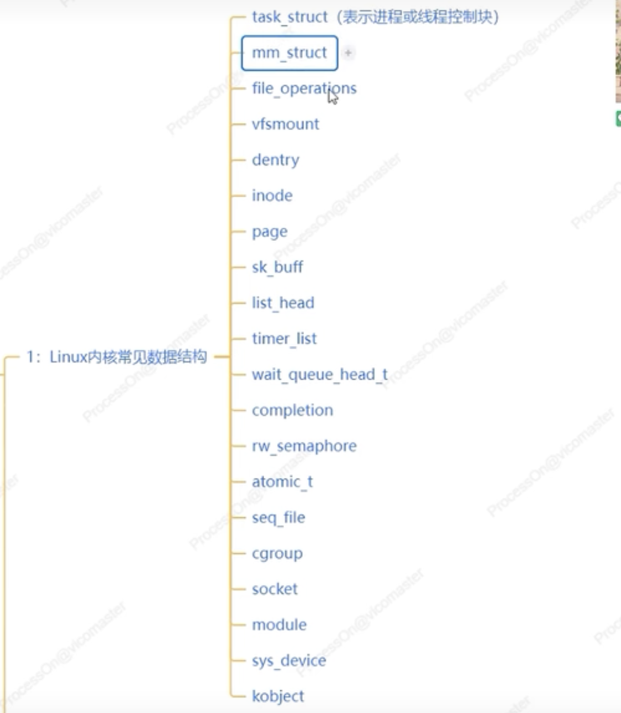
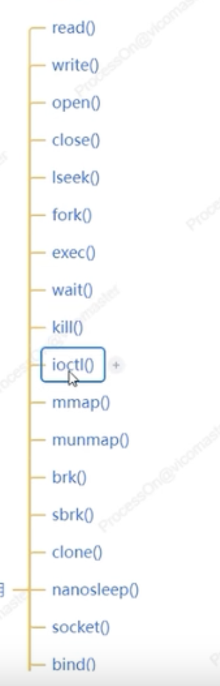
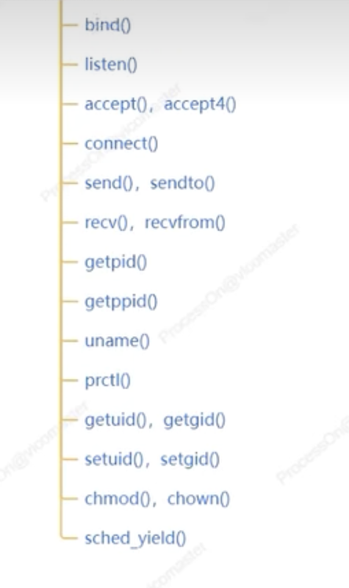
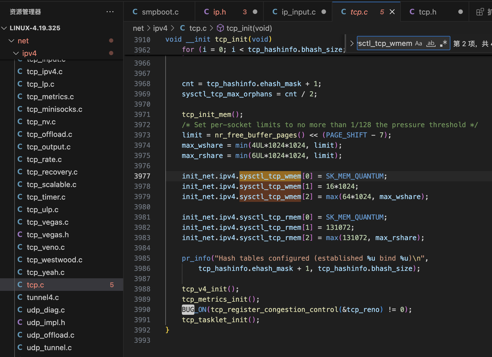

# Linux kernel

阅读源码  从某个模块例如网络协议栈、进程调度、内存管理等

- 进程管理 创建、调度、同步、通信、终止进程或者线程
- 内存管理 负责管理和分配管理内存  虚拟内存、物理内存管理
- 文件系统  负责文件存储、促织、检索和管理 虚拟文件系统 VFS
- 设备驱动   负责管理各种硬件设备（输入输出和存储设备等）
- 网络通信  提供网络结构和通信协议（支持网络连接和数据传输）
- 用户接口  提供用户和 OS 交互的界面（CLI 和 GUI）
- 系统调用  为用户程序提供与操作系统狡猾的接口
- 资源分配  负责各种资源的分配 例如 CPU 时间和内存空间 IO 设备等
- 系统服务  提供基础服务（时间和日期，打印服务等）
- 虚拟化技术  （KVM 虚拟机和容器 (conntainer cgroup 和 namespaces) ）

参考资料：
现代操作系统
UNIX 环境高级编程
Linux 内核设计与实现

**Linux 内核的六大架构**

1. 进程调度器 (Process Scheduler)
2. 内存管理（Memory Manager,MM）
3. 虚拟文件系统（Virtual File  System  vfs）
4. 网络子系统（Network）
5. 进程间的通信（Inter-Process Communication IPC ）
6. 设备驱动 (Device Drivers)
7. 系统调用接口（System  Call Interface）
   **经典参考教程**

- 深入理解 Linux 内核
- 深入 Linux 内核架构

**阅读源码的技术栈**
 Linux 内核常见数据结构
 

 Linux 常见的系统调用
 
 

**5 种内核调试工具**

1. GDB （GPU 调试器）
2. strace  用于跟踪程序执行，进程所调用的系统调用和接收的信号的实现工具

- 系统调用跟踪
- 交互和非交互式
- 调试信息
- 跨平台
- 输出重定向

3. ftrace Linux 内核的跟踪工具，跟踪内核函数调用 系统调用 中断时间 定时器事件等，生成相应的跟踪数据
4. perf  强大的性能分析工具  系统级别监控，内核函数调用 火焰图 内存泄露检测，采样和事件 内核态和用户态分析硬件性能计数器等
5. qemu（开源的、性能优异的模拟器和虚拟化器 特点 跨平台 能模拟多种架构，设备模拟，虚拟化 快照 调试和测试 系统仿真  用户态模块等）

## 1、Process

### 1.1 CFS 完全公平调度

1. 概念
2. 如何实现完全公平
3. 红黑树

## 2.Memory

## 3、NetWork



```bash
[root@cdh23 ~]# cat /proc/sys/net/ipv4/tcp_wmem
4096	16384	16777216
[root@cdh23 ~]# cat /proc/sys/net/ipv4/tcp_rmem
4096	87380	16777216

[root@10-57-31-214 ~]# uname  -r
5.14.0-503.15.1.el9_5.x86_64
[root@10-57-31-214 ~]# cat  /proc/sys/net/ipv4/tcp_rmem
4096	87380	16777216
[root@10-57-31-214 ~]# cat  /proc/sys/net/ipv4/tcp_wmem
4096	65536	16777216
[root@10-57-31-214 ~]#

```

## 4、IO

## 5. Performance
