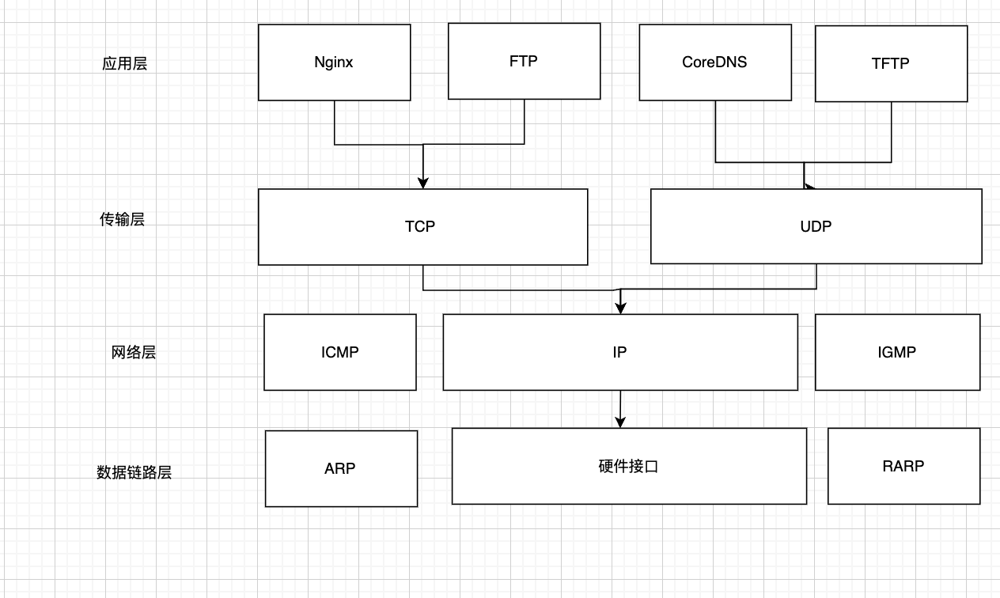
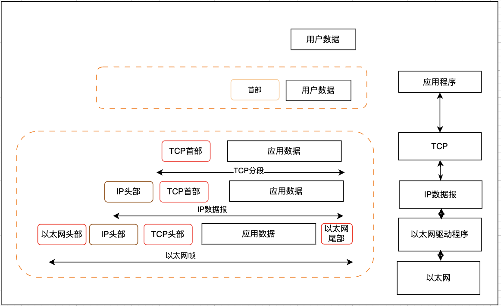
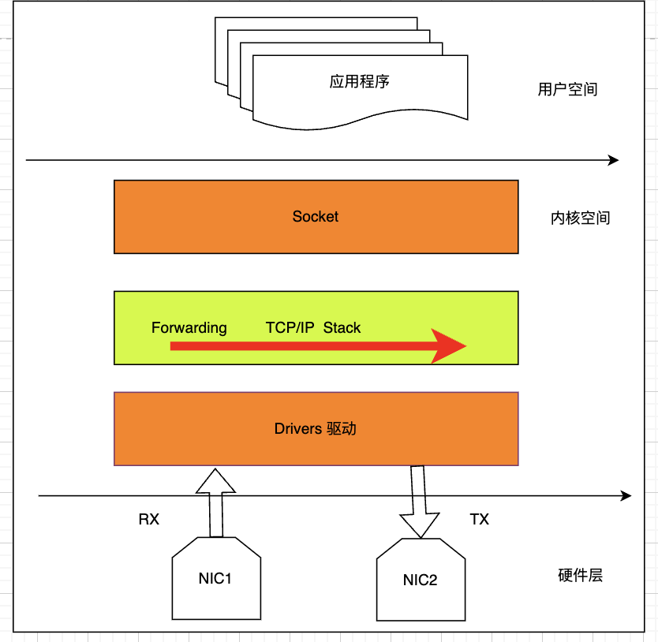
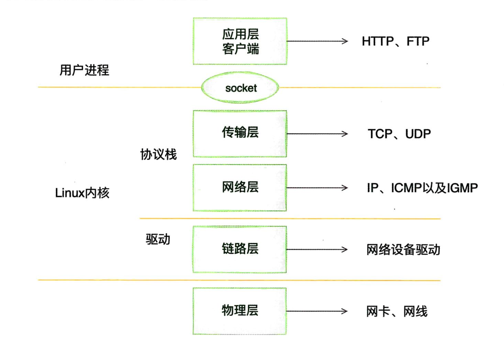
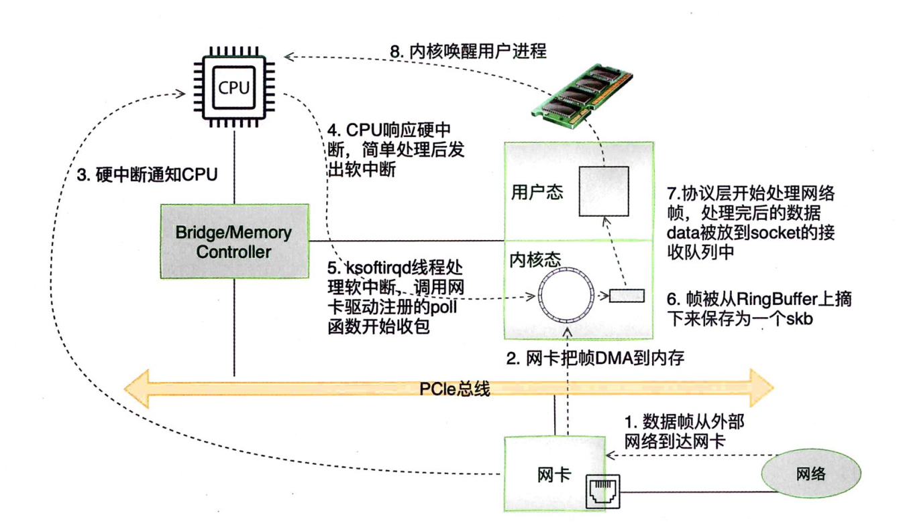

# Linux 内核网络协议栈

## 1.1 数据报文信息的封装

## 1.2 内核协议栈分层架构

## 1.3 协议栈初始化过程

## 1.4 协议栈接收 / 发送包的流程

**内核收包的路径**
 1. 数据帧从外包网络到达网卡
 2. 网卡把帧 DMA 到内存
 3. 硬中断通知 CPU
 4. CPU 响应硬中断，简单处理后发起软中断（Linux 中断处理函数的上半部分和下半部分）简单处理快速释放 CPU 避免影响 CPU 响应其他设备
 5. ksoftirqd 线程处理软中断 调用网卡驱动注册的 epoll 函数处理数据包
 6. 帧被从 RingBuffer 上摘下来保存为 1 个 skb
 7. 协议层开始处理网络帧，处理完后的数据 data 放到 socket 的接收队列中
 8. 内核唤醒用户进程处理
