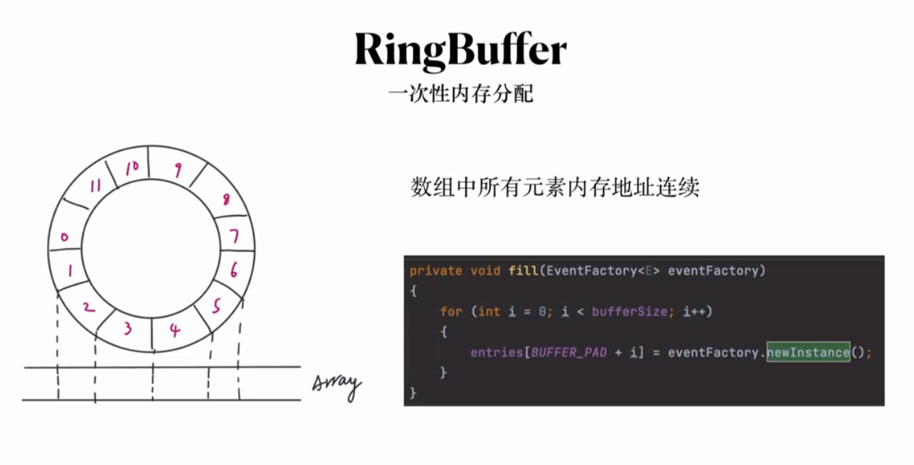

# 性能调优


**上下文切换 (Context Switch)** 是指一个线程被调度出 CPU，另一个线程被选中运行的过程。
核心是：把前一个现场的 CPU 上下文（寄存器、程序计数器）保存起来，加载新线程的上下文到这些寄存器和程序计数器，然后跳转到程序计数器所指的代码位置继续执行。


- 为什么上下文切换
  
  时间片耗尽 (CFS )
  更高的优先级
  硬件中断
  睡眠、阻塞等（IO 等待等）


- 上下文切换到底切换的是什么
  切换任务的虚拟内存空间
  切换寄存器和内核栈
  
- 如何 观测上下文切换
  
  cswch  表示每秒自愿上下文切换（voluntary context  switches）
  nvcswch  表示每秒非自愿上下文切换（no  voluntary context  switches）
  **中断**


- 硬中断
- 软中断

  

  中断的上下部分：

软中断带来的问题


```dotnetcli
cat  /proc/softirqs   |awk 'NR>1{printf("%20s\t%10s\n",$1,$11)}' #11为CPU数量

watch -d -n  1  cat  /proc/softirqs

```

**平均负载 (Load Average)**


正在使用、正在等待


CPU 密集和 IO 密集


```dotnetcli
sha256sum /dev/zero
```


IO 密集类型


CPU 的多级缓存





**火焰图**


**协程**


协程的原理


多线程是单进程内实现并发多任务
多进程的资源共享和通信会很复杂，进程的上下文切换代价更大

协程能简化异步并发任务，以同步方式写异步代码


线程、协程和进程是操作系统中的三种不同的执行单元，它们各自有不同的特点和使用场景。以下是它们的主要区别：

1. 进程 (Process)
   **定义**：进程是操作系统分配资源的基本单位。每个进程都有自己的地址空间、内存管理和资源。
   - 特性：
   1. 独立性：进程之间相互独立，一个进程的崩溃不会直接影响其他进程。
   2. 资源消耗：创建和销毁进程的开销较大，因为需要分配和管理独立的资源。
   3. 通信：进程间通信（IPC）相对复杂，通常需要使用管道、消息队列、共享内存等机制。
2. 线程 (Thread)
   **定义**：线程是进程内部的一个执行单元。一个进程可以包含多个线程，这些线程共享进程的资源（如内存和文件描述符）。
   - 特性：
   1. 轻量性：线程的创建和销毁开销较小，因为它们共享同一进程的资源。
   2. 共享资源：线程之间可以直接访问共享的内存数据，但这也需要注意线程安全问题。
   3. 通信：线程之间通信相对简单，可以直接访问共享变量。
3. 协程 (Coroutine)
   **定义**：协程是一种用户级的轻量级线程，由程序员控制的执行单元。协程可以在一个线程中并发执行。
   - 特性：
   1. 更轻量：创建和切换协程的开销非常小，因为协程在同一线程内运行，且不需要上下文切换。
   2. 非抢占式：协程的调度是由程序员控制的，通常通过函数调用或特定的调度器。
   3. 适合 I/O 密集型任务：协程特别适合处理大量 I/O 操作的任务，例如网络请求，因为它们能够在等待 I/O 时让出控制权。

| 特性       | 进程           | 线程         |     协程     |
| ---------- | -------------- | ------------ | :-----------: |
| 独立性     | 高             | 中           |      低      |
| 资源消耗   | 高             | 低           |     更低     |
| 通信复杂度 | 高             | 低           |     极低     |
| 调度方式   | 操作系统管理   | 操作系统管理 |   用户管理   |
| 适用场景   | 计算密集型任务 | 多任务并发   | I/O 密集型任务 |

线程是 CPU 调度的最小单位，进程是资源分配的最小单位。

进程：进程是资源分配的最小单位，进程在执行过程中拥有独立的内存单元。
线程：线程是 CPU 调度的最小单位，线程切换只须保存和设置少量寄存器的内容。

虽然线程比较轻量，但是在调度时也有比较大的额外开销。每个线程会都占用 1M 以上的内存空间，在切换线程时不止会消耗较多的内存，恢复寄存器中的内容还需要向操作系统申请或者销毁资源。

协程跟线程是有区别的

线程 / 进程是内核进行调度，有 CPU 时间片的概念，进行 抢占式调度（有多种调度算法）
协程 对内核是透明的，也就是系统并不知道有协程的存在，是完全由用户自己的程序进行调度的，因为是由用户程序自己控制，那么就很难像抢占式调度那样做到强制的 CPU 控制权切换到其他进程 / 线程，通常只能进行 协作式调度，需要协程自己主动把控制权转让出去之后，其他协程才能被执行到。

goroutine 存在的意义是什么？
goroutine 的存在必然是为了换个方式解决操作系统线程的一些弊端

创建和切换太重 操作系统线程的创建和切换都需要进入内核，而进入内核所消耗的性能代价比较高，开销较大；
内存使用太重 内核在创建操作系统线程时默认会为其分配一个较大的栈内存，内核在创建操作系统线程时默认会为其分配一个较大的栈内存，同时会有溢出的风险；

goroutine 的优势也就是 开销小

goroutine 是用户态线程，其创建和切换都在用户代码中完成而无需进入操作系统内核，所以其开销要远远小于系统线程的创建和切换；
goroutine 启动时默认栈大小只有 2k，这在多数情况下已经够用了，即使不够用，goroutine 的栈也会自动扩大，同时，如果栈太大了过于浪费它还能自动收缩，这样既没有栈溢出的风险，也不会造成栈内存空间的大量浪费。
