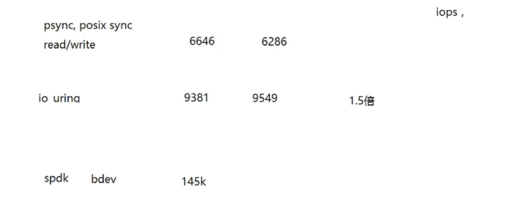
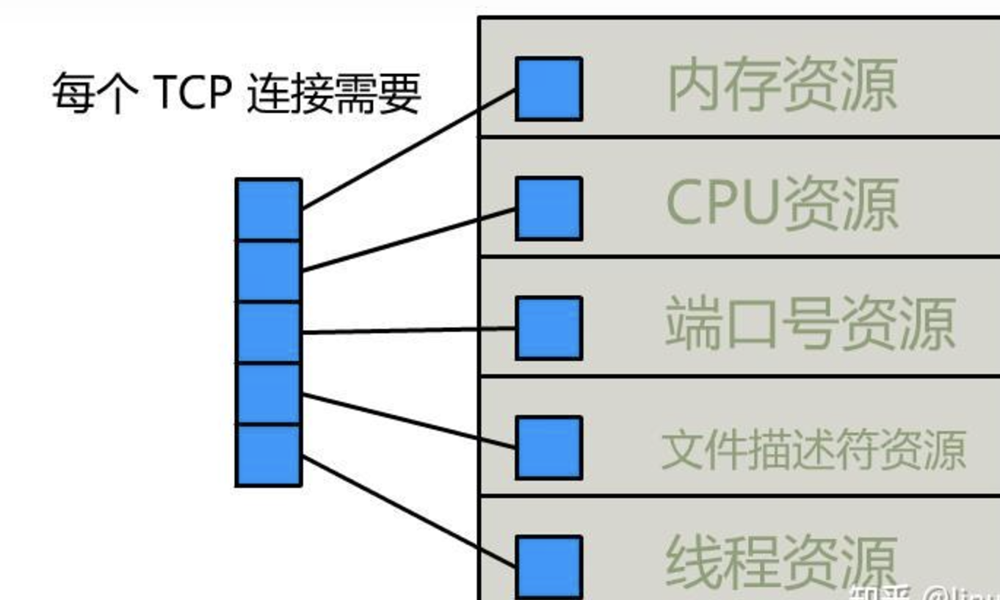

## 1. Namespace

在 Linux 5.x 内核中，命名空间（namespace）继续为资源的隔离和管理提供支持。以下是八种主要的命名空间：

### 1.1 **Mount Namespace (`mnt`)**

* **功能** ：隔离文件系统的挂载点。
* **用途** ：每个命名空间可以有独立的挂载点，使得容器具有不同的文件系统视图。

### 1.2 **Process Namespace (`pid`)**

* **功能** ：隔离进程 ID。
* **用途** ：允许在不同命名空间中使用相同的 PID，支持容器内的进程管理。

### 1.3 **Network Namespace (`net`)**

* **功能** ：隔离网络资源，包括网络接口、IP 地址和路由表。
* **用途** ：允许容器拥有独立的网络堆栈，确保网络配置的隔离。

### 1.4 **IPC Namespace (`ipc`)**

* **功能** ：隔离进程间通信资源，如信号量、消息队列和共享内存。
* **用途** ：使得在不同命名空间中的进程可以独立使用 IPC 机制。

### 1.5 **UTS Namespace (`uts`)**

* **功能** ：隔离主机名和域名。
* **用途** ：允许容器设置自己的主机名和域名，而不影响宿主机或其他容器。

### 1.6 **User Namespace (`user`)**

* **功能** ：隔离用户和组 ID。
* **用途** ：提供安全性，允许容器以非特权用户身份运行，并控制权限。

### 1.7 **Cgroup Namespace (`cgroup`)**

* **功能** ：隔离 cgroup 资源。
* **用途** ：使得进程在不同的命名空间中具有独立的 cgroup 视图，以便更好地管理资源。

### 1.9 **Time Namespace (`time`)**

* **功能** ：隔离系统时间。
* **用途** ：允许在不同的命名空间中设置和管理时间，支持容器在不同时间环境下运行。

### 总结

这些命名空间提供了进程和资源的强大隔离能力，使得 Linux 在容器化和虚拟化方面非常有效。通过使用不同的命名空间，用户可以在同一主机上运行多个相互独立的环境，提高了安全性和资源利用率。如果您有更多问题或需要更详细的信息，请随时询问！

 CGROUP  4.X 内核支持
  Time   5.X 内核支持

## 2. Cgroup

 有 V1 和 V2 版本的区别，主要是层级结构的变化

 CPU
    cpuset   绑定核心
    cpu.shares  1024 根据比例分配 CPU
    cpu.cfs_period_us 100000us 100ms
    cpu.cfs_quota_us

 Memory
   max limit

 IO

## 3. CPU 的四种进程调度

## 4. Linux 的进程调度

- CFS（Completely Fair Scheduler）
  是 Linux 内核中的默认进程调度器。它主要用于公平地分配 CPU 时间给各个进程，确保所有进程在 CPU 时间的使用上尽可能公平。

CFS 的主要特点

- 公平性：
  CFS 的设计目标是确保所有进程都能公平地获得 CPU 时间。每个进程根据其优先级和 CPU 使用情况被分配时间片。
- 时间片：
  CFS 不使用固定的时间片，而是根据进程的权重（优先级）动态计算每个进程应该获得的 CPU 时间。高优先级的进程会获得更多的 CPU 时间。
- 红黑树：
  CFS 使用红黑树数据结构来管理可运行的进程。每个进程在树中的位置根据其“虚拟运行时间”（vruntime）来决定。vruntime 是进程实际运行时间与其权重的比值，权重越高，vruntime 增加得越慢。
- 上下文切换：
  CFS 尽量减少上下文切换的成本，通过选择 vruntime 最小的进程来进行调度，从而实现低延迟和高吞吐量。
- 优先级：
  CFS 支持动态优先级调整。进程在 CPU 上运行的时间越长，其优先级（nice 值）就会逐渐降低，反之亦然，这样可以避免某些进程长期占用 CPU。
  配置 CFS 调度器

1. 查看当前调度策略
   您可以使用 ps 命令查看当前进程的调度策略：

```bash
ps -eo pid,comm,cls,nice
其中，cls 列显示调度策略，CFS 使用的调度策略是 SCHED_OTHER。
```

1. 修改进程的优先级
   您可以使用 nice 和 renice 命令来调整进程的优先级：

使用 nice 创建新进程时设置优先级：

```dotnetcli
nice -n 10 ./your_program
```

使用 renice 修改运行中进程的优先级：

```dotnetcli
renice -n 10 -p <pid>

```

### 4.1 CFS 的调度过程

进程进入就绪队列：
当进程准备好运行时，它会进入就绪队列，并根据其 vruntime 进行排序。
选择进程：
CFS 从就绪队列中选择 vruntime 最小的进程进行调度。
时间片管理：
被调度的进程会运行，直到它的时间片用完、被更高优先级的进程抢占，或自愿放弃 CPU。
上下文切换：
当需要调度其他进程时，CFS 会进行上下文切换，将当前进程的状态保存到内存，并加载下一个进程的状态。
总结
CFS 通过使用 vruntime 和红黑树数据结构实现了公平、高效的 CPU 调度。它支持动态优先级调整，可确保所有进程都能获得合理的 CPU 时间。了解 CFS 的工作原理和配置方法可以帮助您更好地管理系统性能和资源使用

## 5. Linux 的五种 IO 模型

1. 阻塞 I/O（Blocking I/O）
   描述：在阻塞 I/O 模型中，当进程发起 I/O 操作时，进程会被挂起，直到操作完成。对于读取操作，进程会等待数据到达；对于写入操作，进程会等待数据被成功写入。
   **优点：**
   简单易用，编程模型直观。
   **缺点：**
   效率较低，特别是在等待 I/O 时，CPU 无法执行其他任务。
2. 非阻塞 I/O（Non-blocking I/O）
   描述：在非阻塞 I/O 模型中，进程发起 I/O 操作后，如果操作不能立即完成，进程不会被挂起，而是立即返回。这意味着进程可以继续执行其他任务，并在之后再次检查 I/O 操作的状态。
   优点：
   提高了 CPU 的使用率，允许进程做其他工作。
   缺点：
   编程复杂性增加，需要轮询或使用其他机制来检查 I/O 操作的完成。
3. I/O 多路复用（I/O Multiplexing）
   描述：使用 select、poll 或 epoll 等系统调用，进程可以监视多个 I/O 流并等待其中一个或多个变为可读或可写。进程可以同时处理多个连接。
   优点：
   适用于需要处理大量并发连接的场景，如网络服务器。
   缺点：
   使用复杂，尤其在管理多个文件描述符时。
4.
5. 信号驱动 I/O（Signal-driven I/O）
   描述：在信号驱动 I/O 模型中，进程可以注册一个信号处理程序，当 I/O 操作准备好时，内核会发送一个信号（如 SIGIO）给进程。进程在收到信号后可以执行相应的处理。
   优点：
   允许进程在 I/O 准备好时被通知，避免了轮询。
   缺点：
   信号处理的复杂性，可能会导致信号丢失或处理顺序问题。
6. 异步 I/O（Asynchronous I/O）
   描述：在异步 I/O 模型中，进程发起 I/O 操作后立即返回，并可以在操作完成时通过回调函数或其他机制被通知。当 I/O 操作完成后，数据会自动被传输到指定的缓冲区。
   优点：
   高效，允许进程在 I/O 操作完成时继续执行其他任务。
   缺点：
   实现复杂性较高，需要支持异步操作的库或框架。

### 5.1 多路复用模型

**select**

**poll**

**epoll**
1、数据结构 红黑树 + 链表   O(log(n))

epoll 三板斧
epoll_create(int size)
epoll_ctl(int epfd, int op, int fd, struct epoll_event *event)
epoll_wait(int epd, struct epoll_event *events, int maxevents, int timeout)

**io_uring**  异步 IO
是 Linux 内核中的一种新型异步 I/O 接口，旨在提供高效的 I/O 操作。它通过减少系统调用的开销和上下文切换，提高了应用程序的性能。以下是有关 io_uring 的一些关键点：
主要特点
异步 I/O：
允许应用程序发起 I/O 操作，而不需要阻塞等待其完成，从而提高了并发性。
提交与完成队列：
io_uring 使用两个环形缓冲区：提交队列（SQ）和完成队列（CQ）。
应用程序将 I/O 请求放入提交队列，内核处理这些请求后，将结果放入完成队列。
减少系统调用：
应用程序可以通过单个系统调用提交多个 I/O 请求，减少了上下文切换的成本。
支持多种 I/O 操作：
包括文件 I/O、网络 I/O、块设备 I/O 等，支持多种类型的操作。
高效的内存管理：
使用共享内存和固定大小的缓冲区，减少了内存分配的开销。

- 使用要求  内核版本 5.10 以上
-

Rocky 9.4 启用 io_uring

```
1、检查内核版本
uname -r

2、 您可以通过查看 /boot/config-$(uname -r) 文件来确认 io_uring 是否在内核中启用：、
cat /boot/config-$(uname -r) | grep IO_URING
3、 检查 io_uring 相关的内核参数
sysctl -a | grep io_uring
kernel.io_uring_disabled = 2
kernel.io_uring_group = -1
4、开启
echo 0 | sudo tee /proc/sys/kernel/io_uring_disabled
或者
kernel.io_uring_disabled = 0
sudo sysctl -p

```



**spdk** 性能会更好

Go 语言网络 IO 模型之 epoll



| 资源         | 一台 Linux 服务器的资源 | 一个 TCP 连接占用的资源 | 占满了会发生什么                |
| ------------ | ----------------------- | ----------------------- | ------------------------------- |
| CPU          | 看你花多少钱买的        | 看你用它干嘛            | 电脑卡死                        |
| 内存         | 看你花多少钱买的        | 取决于缓冲区大小        | OOM                             |
| 临时端口号   | ip_local_port_range     | 1                       | cannot assign requested address |
| 文件描述符   | fs.file-max             | 1                       | too many open files             |
| 进程、线程数 | ulimit -n               | 看 IO 模型              | 系统崩溃                        |
