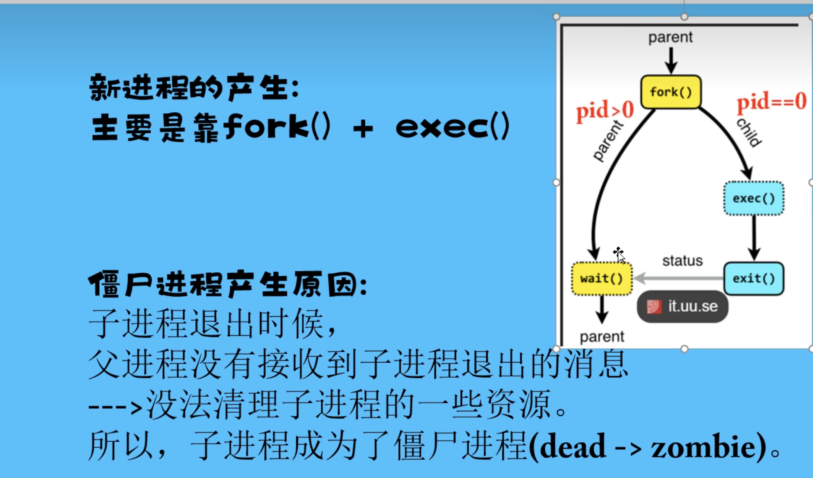

# Linux 进程调度

**Linux 进程** 可以分为  CPU 消耗类型和 IO 类型，Linux 内核的调度器通常倾向于提高系统的响应性，例如（桌面系统的实时响应）

## 1. 进程分类以及优先级

### 1.1 进程分类

   Linux 进程主要分为：内核线程  用户态线程 实时进程  守护进程以及轻量级进程

### 1.2  Linux 内核的进程优先级  实时优先级和普通优先级

- 实时优先级 轮流调度（SCHED_RR）和先进先出（SCHED_FIFO）
- 普通优先级  CFS （完全公平调度 -- 红黑树实现）和 nice 值（nice 值越低，进程优先级越高，反之则越低，最高是 -20，最低是 19）
- nice 优先级  在 Linux 中，nice 命令用于调整进程的优先级。进程的优先级范围从 -20 到 19，具体如下：
  **nice 优先级范围**
  - -20：最高优先级（优先级高于普通进程）。具有这个优先级的进程将获得更多的 CPU 时间。
  - 0：默认优先级。大多数进程的初始优先级。
  - 19：最低优先级（优先级低于普通进程）。具有这个优先级的进程将在 CPU 资源分配上处于劣势。

可以使用 nice 命令来启动一个新进程并设置其优先级。例如：

```bash
# 启动一个新进程，设置优先级为 10
nice -n 10 command
调整现有进程的优先级
要调整现有进程的优先级，可以使用 renice 命令。例如：

# 将进程 ID 为 1234 的进程优先级设置为 -5

sudo renice -5 -p 1234
```

**注意事项**
只有超级用户（root）可以将优先级设置为负值（-20 到 -1）。
普通用户只能设置优先级为 0 到 19 的值，不能提高其他用户进程的优先级。
**总结**
Linux 中的进程优先级范围从 -20 到 19，使用 nice 和 renice 命令可以管理进程的优先级，以便更有效地分配 CPU 资源。如果您有其他问题或需要更多信息，请告诉我！

## 2. 时间片以及调度算法

### 2.1 时间片

**时间片** 是操作系统（OS）将 CPU 分配给进程执行的时间段（默认的时间段是 10ms，时间片可以通过修改内核参数修改）

### 2.2 调度算法

- CFS （完全公平调度算法）
- RT（实时调度算法）
- MLFQ （多级反馈队列调度算法）
- RR 轮转调度算法

## 3. 多核调度原理与算法

### 3.1 多级调度原理

- 时间片
- 抢占式
- 优先级队列

### 3.2 Linux 内核多核调度算法

- CFS （完全公平调度算法）
- 实时调度算法 （FIFO Deadline 截止期调度算法，RR）

### 3.3 CFS 调度算法

 基于红黑树的时间片轮转调度算法，为每个任务维护一个虚拟运行时间来决定下一个被调度的任务

 **实现模式** 将所有正在执行的任务插入到一颗红黑树中，树节点按照虚拟运行时间进行排序，调度器优先选择最小运行时间的节点作为下一个要执行任务，并且将它移到树的末尾，
 目的（红黑树中的进程都得到相等的 CPU 时间）

 **CFS 优点** 公平性和扩展性

 **CFS 缺点** 可能导致上下文切换的频率不断增加，因为每次调度时需要遍历整个红黑树，来找到最小最小虚拟运行时间节点。

## 4. Linux 内核 进程、线程、协程

### 4.1 进程

正在运行的程序，资源分配的最小单位（CPU、内存 文件等）

### 4.2 线程

线程 是 CPU 调度的最小单位

### 4.3 协程

协程是另外一种并发的的方式

- 协程能解决什么问题？

## 5 僵尸进程和孤儿进程

**僵尸进程**   一个进程使用 fork 创建子进程，如果子进程退出，而父进程并没有调用 wait 或 waitpid 获取子进程的状态信息，那么子进程的某些信息如进程描述符仍然保存在系统中。这种进程称之为僵尸进程。


任何一个子进程 (init 除外） 在 exit() 之后，并非马上就消失掉，而是留下一个称为僵尸进程 (Zombie) 的数据结构，等待父进程处理。这是每个子进程在结束时都要经过的阶段。如果子进程在 exit() 之后，父进程没有来得及处理，这时用 ps 命令就能看到子进程的状态是“Z”。如果父进程能及时 处理，可能用 ps 命令就来不及看到子进程的僵尸状态，但这并不等于子进程不经过僵尸状态。  如果父进程在子进程结束之前退出，则子进程将由 init 接管。init 将会以父进程的身份对僵尸状态的子进程进行处理

#### 僵尸进程的危害：

僵尸进程会在系统中保留其某些信息如进程描述符、进程 id 等等。以进程 id 为例，系统中可用的进程 id 是有限的，如果由于系统中大量的僵尸进程占用进程 id，就会导致因为没有可用的进程 id 系统不能产生新的进程，这种问题可就大了，这就是僵尸进程带来的危害。因此大部分情况下，我们都应当避免僵尸进程的产生。

#### 如何消除僵尸进程：

严格地来说，僵死进程并不是问题的根源，罪魁祸首是产生出大量僵死进程的那个父进程。因此，当我们寻求如何消灭系统中大量的僵死进程时，答案就是把产生大量僵死进程的那个元凶枪毙掉（也就是通过 kill 发送 SIGTERM 或者 SIGKILL 信号）。

枪毙了元凶进程之后，它产生的僵死进程就变成了孤儿进程，这些孤儿进程会被 init 进程接管，init 进程会 wait() 这些孤儿进程，释放它们占用的系统进程表中的资源。这样，这些已经僵死的孤儿进程就能瞑目而去了。

**孤儿进程** 孤儿进程是指子进程还在运行的过程中，父进程已经终止运行，而子进程还未结束运行，最后孤儿进程将会被 init 进程（进程号为 1）的进程收养，当然在子进程结束时也会由 init 进程完成对它的状态收集工作，因此一般来说，孤儿进程并不会有什么危害。

```
1、 如何查看linux系统上的僵尸进程，或者如何统计有多少僵尸进程？

命令：ps -ef | grep defunct

或者查找状态为Z的进程，Z就是代表zombie process,僵尸进程的意思，使用top命令查看,如果状态为Z也就是(zombie process)说明它就是僵尸进程。

Tasks: 85 total, 2 running, 82 sleeping, 0 stopped, 0 zombie

top命令也可以查看。或者使用下面的命令：

ps -ef | grep defunct | grep -v grep | wc -l

2、如何杀死僵尸进程？

一般僵尸进程很难直接kill掉，不过您可以kill父进程(僵尸父亲)，“父亲”死后，僵尸进程成为”孤儿进程”，接着给init它始终会负责清理僵尸进程．紧随着父亲消失了，儿子也就跟着消失了。

ps -e -o pid,ppid,stat | grep Z | cut –d” ” -f2 | xargs kill -9

kill -HUP ps -A -ostat,ppid | grep -e ’^[Zz]‘ | awk ’{print $2}’

```

## 6   fork 和 exec 的区别

`clone` 和 `fork` 是用于创建新进程的两个不同系统调用。它们在功能、用途和实现上有显著区别。以下是它们的主要区别：

### 6.1 两者的定义

 **fork** ：
  `fork` 是创建一个新进程的系统调用，新的进程称为子进程。子进程是父进程的一个副本，拥有相同的地址空间、打开的文件描述符等。
 子进程的 PID（进程标识符）不同于父进程，且在子进程中返回的值为 0，而在父进程中返回的是子进程的 PID。
 **clone** ：
 `clone` 是一个更为灵活的系统调用，可以创建新进程或线程，允许调用者选择共享哪些资源（如内存、文件描述符、信号处理等）。
 `clone` 允许更细粒度的控制，适用于实现线程和轻量级进程。

### 6.2. 共享资源

 **fork** ：
 在 fork 之后，父进程和子进程各自拥有独立的地址空间。对一个进程的修改不会影响另一个进程，尽管在调用时，它们共享相同的物理内存（采用写时复制机制）。
* **clone** ：
* `clone` 可以配置共享的资源。调用者可以指定哪些资源（如地址空间、文件描述符、信号等）是共享的。例如，可以创建一个共享内存的线程。

### 6.3. 使用场景

**fork** ：
 通常用于创建子进程，例如在服务器中处理多个请求。每个请求会创建一个独立的进程，处理完毕后可以终止。
**clone** ：
常用于实现线程或轻量级进程。Linux 中的线程实际上是通过 `clone` 系统调用实现的，允许多个线程共享相同的地址空间。

### 6.4. 语法和参数

  **fork** ：语法简单，仅需要调用：

  ```
  pid_t pid = fork();
  ```

* **clone** ：
语法较复杂，通常需要指定共享标志和栈：
  **复制**

  ```
  intclone(int flags, void *stack, int *ptid, int *ctid, unsignedlong newtls);
  ```

### 6.5 性能

 **fork** ：
 `fork` 的开销相对较大，尤其是在创建多个进程时，因为每个进程都需要独立的地址空间。
 **clone** ：
 `clone` 的开销较小，因为它可以选择性地共享资源，适合创建大量线程。

### 6.6 总结

 **fork** 是用于创建独立进程的系统调用，适用于需要完整隔离的场景。
 **clone** 是一个灵活的系统调用，用于创建线程或轻量级进程，允许共享特定资源。

## 7 什么是内存映射（Memory Mapping）

## 8 描述 Linux 中的 I/O 调度

I/O 调度算法（如 CFQ、Deadline 等）及其工作原理。
在 Linux 中，I/O 调度算法用于管理块设备的读写请求，优化性能和响应时间。以下是常见的 I/O 调度算法及其查看和配置方法。

常见的 I/O 调度算法
**CFQ（Completely Fair Queuing）**
默认的调度器，针对每个进程分配公平的 I/O 带宽。
**Deadline**
结合了 FIFO 和优先级的调度算法，确保每个请求在一定时间内被处理。
**NOOP**
简单的调度器，主要用于 SSD 等不需要复杂调度的设备，使用 FIFO 队列。
**BFQ（Budget Fair Queueing）**
为每个进程提供可配置的带宽预算，适用于需要高性能的交互式应用。
**Anticipatory**
通过预测读请求的性质来改善性能，适用于重读模式的工作负载。

```dotnetcli
如何查看当前的 I/O 调度算法
要查看当前块设备使用的 I/O 调度算法，可以使用以下命令：
cat /sys/block/<device>/queue/scheduler
例如，要查看 /dev/sda 的调度器：
cat /sys/block/sda/queue/scheduler
输出可能类似于：
noop deadline [cfq]
其中，方括号中的调度器表示当前使用的调度算法。
如何配置 I/O 调度算法
要更改块设备的 I/O 调度算法，可以使用以下命令：
echo <scheduler> > /sys/block/<device>/queue/scheduler
例如，要将 sda 的调度算法更改为 deadline：
echo deadline > /sys/block/sda/queue/scheduler
永久配置
要使更改在系统重启后仍然有效，可以在启动时通过修改 GRUB 配置文件来设置。步骤如下：

打开 /etc/default/grub 文件。
找到 GRUB_CMDLINE_LINUX 行，并添加调度器设置。例如：
GRUB_CMDLINE_LINUX="elevator=deadline"
更新 GRUB 配置：

sudo update-grub
重启系统。
其他命令
查看块设备信息：
lsblk
查看当前 I/O 性能：
iostat -x 1
总结
```

## 9
