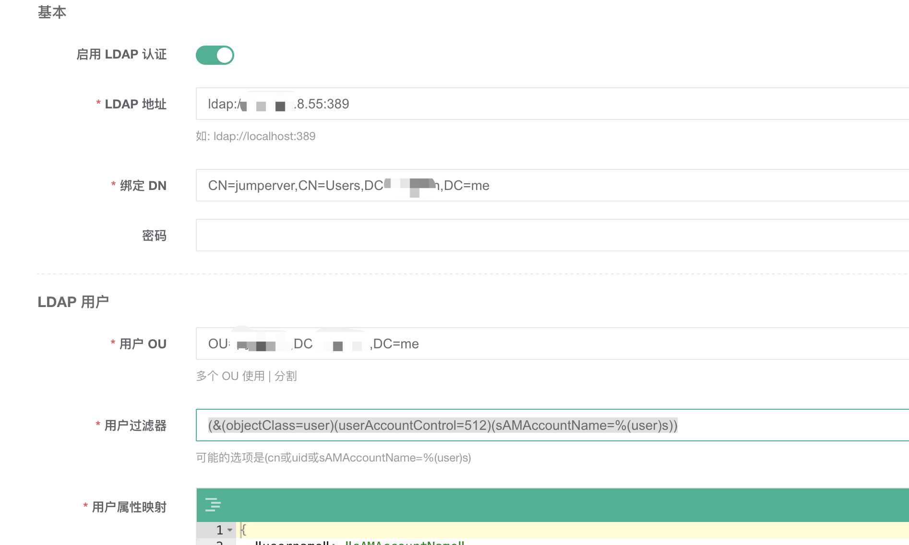

jumpserver  对接 ADserver

```dotnetcli

#用户过滤器 过滤userAccountControl  512  表示启用的账户  544为位启用的账户
(&(objectClass=user)(userAccountControl=512)(sAMAccountName=%(user)s))

#用户属性映射
{
  "username": "sAMAccountName",
  "name": "cn",
  "email": "mail",
  "comment": "department",
  "phone": "telephoneNumber"
}
```


