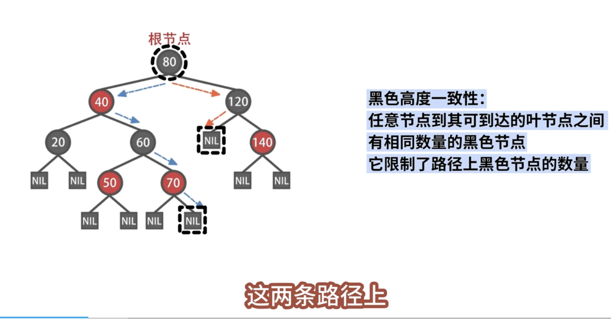

# 数据结构

**程序 = 数据结构 + 算法**

**数据结构类型**

建立数学模型 --->设计算法 --- 编写程序 -- 测试、调整程序解决问题

## 1. 常见数据结构

- 数组  Array
- 线性表 Linear List
- 栈 Stack
- 列表 List
- 链表  Linked List
- 队列 Queue
- 树 Tree
- 图 Graph
- 堆 Heap
- 散列表和哈希表 （Hash）

1. 树形结构

- 二叉树（红黑树）
  
  
  
  
  红黑树的性质：
  
  
  
  

**Linux 中四个经典的使用场景**

- 进程管理与调度的红黑树；
- 虚拟内存区域的红黑树；
- 网络 sk_buff 的红黑树；
- epoll 的红黑树
- 多叉树（B 树，B+ 树 ）

## 2 常见算法

**排序**

- 选择排序
- 冒泡排序
- 快速排序
- 插入排序
- 归并排序
- 堆排序
- 桶排序
- 计数排序
- 基数排序

**查找**

- 二分查找
-

## 3. 经典面试题

1. MySQL 为什么使用 B+ tree 而不选择 B tree
   在 MySQL 的 InnoDB 存储引擎中，使用 B+ 树而不是 B 树的原因主要有以下几点：
   1. 高效的范围查询
      B+ 树的叶子节点：在 B+ 树中，所有的值都存储在叶子节点中，内部节点仅存储索引。这使得所有的叶子节点通过指针相连，支持高效的范围查询和顺序遍历。
      顺序访问：由于叶子节点是链表结构，扫描一系列连续的值时，B+ 树可以更快地访问。
   2. 更好的磁盘 IO 性能
      节点大小：B+ 树的节点可以存储更多的指针和数据，减少了树的高度。这意味着更少的磁盘 IO 操作，因为每一次读取可以获取更多的信息。
      内存和磁盘的使用：B+ 树通常会比 B 树更有效地利用内存和磁盘空间，适合处理大量数据。
   3. 更高的插入和删除效率
      结构调整：在 B+ 树中，插入和删除操作通常只影响叶子节点，减少了树的重组需求。这使得这些操作更高效。
      稳定性：由于内部节点不存储实际数据，B+ 树在插入和删除时更易于维护其平衡性。
   4. 支持更高的并发
      行级锁定：InnoDB 支持行级锁定，B+ 树的结构使得对不同叶子节点的操作可以并行进行，从而提高并发性能。
      更少的锁竞争：由于数据在叶子节点中，多个事务可以在不同的叶子节点上进行操作，减少了锁竞争。
   5. 简化的实现
      实现简单性：B+ 树的设计简化了许多操作，如查找、插入和删除逻辑。这使得 B+ 树在实现上相对简单，且更易于维护。
      总结
      InnoDB 选择 B+ 树而不是 B 树，主要是因为 B+ 树在范围查询、磁盘 IO 性能、插入和删除效率、并发支持和实现简化等方面具有明显优势。这些特点使得 B+ 树在数据库系统中成为一种非常有效的数据结构。如果您有更多问题或需要更深入的解释，请告诉我！
