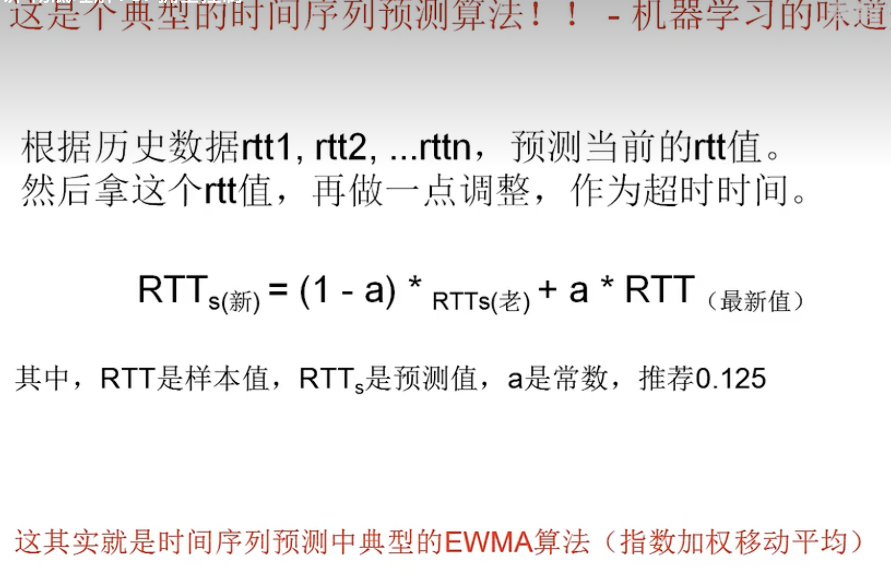
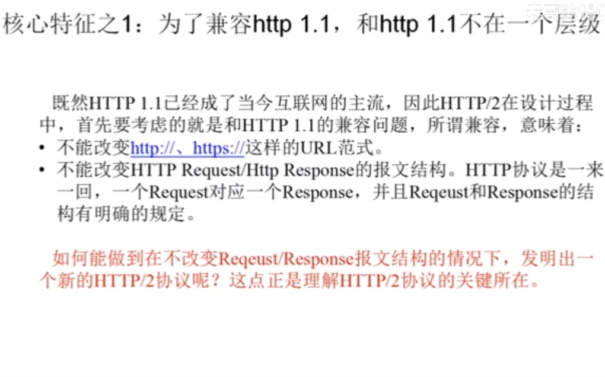
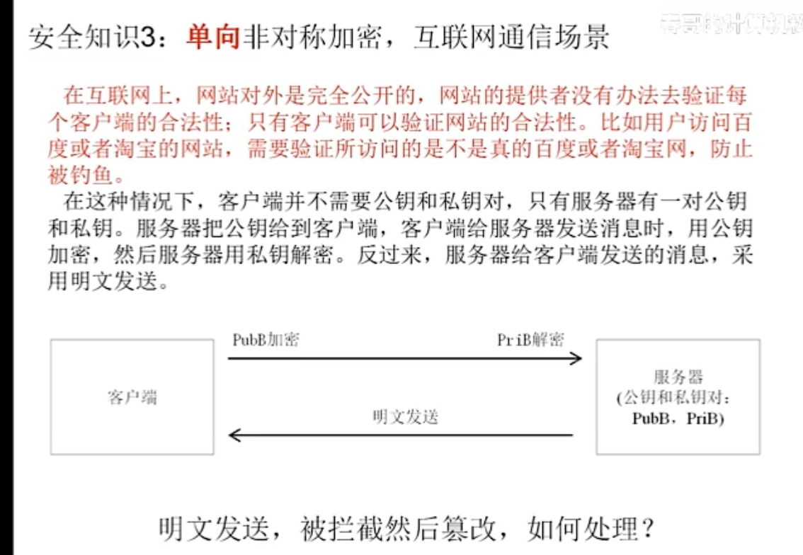

# 网络

## 1、网络基础知识

OSI 网络模型 VS TCP/IP 模型

通信到 IO    分布式

网络到 IO    微服务

中间件

## 2、网络协议

### 2.1 IP 协议


wireshark 分析 Internet Portocol


Linux  IP 协议数据结构

```c
struct iphdr {
#if defined(__LITTLE_ENDIAN_BITFIELD)
	__u8 ihl : 4,
	version : 4; //V4 版本
#elif defined(__BIG_ENDIAN_BITFIELD)
	__u8 version : 4, ihl : 4;
#else
#error "Please fix <asm/byteorder.h>"
#endif
	__u8 tos; //TOS  服务质量 QOS
	__be16 tot_len; // 包括报头在内的数据包总长度，单位位字节 显示拥塞的通知
	__be16 id; // ipv4 报头标识（对于分段来讲，id字节非常重要，对SKB进行分段重组时，对于分段后的数据包，则要根据各个分段的id进行重组）
	__be16 frag_off; //分段偏移量 长度16位 001 表示后面还有其他分段  010 表示不分段  100 表示拥塞
	__u8 ttl;
	__u8 protocol; //协议位 例如TCP 6  UDP 17 等
	__sum16 check; //校验和 IPV4的报头计算得到·
	__be32 saddr; // 源地址
	__be32 daddr; //目的地址
	/*The options start here. */
};

```

### 2.2 TCP 协议

TCP 首部
源端口 16 位  | 目的端口 16 位
序号位  32 位
确认序号 32 位
首部长度 4 位   保留 6 位  6 位标志位   16 位窗口长度
16 位首部校验和   16 位 紧急指针
选项位
数据


- 常见标志
- ACK
- SYN
- FIN
- PUSH
- RSET
- URG 紧急指针位

Linux  TCP 的协议数据结构


```
    struct tcphdr {
  	__be16	source;
  	__be16	dest;
  	__be32	seq;
  	__be32	ack_seq;
#if defined(__LITTLE_ENDIAN_BITFIELD)
  	__u16	res1:4,
  		doff:4,
  		fin:1,
  		syn:1,
  		rst:1,
  		psh:1,
  		ack:1,
  		urg:1,
  		ece:1,
  		cwr:1;
#elif defined(__BIG_ENDIAN_BITFIELD)
  	__u16	doff:4,
  		res1:4, //
  		cwr:1,
  		ece:1,
  		urg:1,
  		ack:1,
  		psh:1,
  		rst:1,
  		syn:1,
  		fin:1;
#else
#error	"Adjust your <asm/byteorder.h> defines"
#endif
  	__be16	window;
  	__sum16	check;
  	__be16	urg_ptr;
};

```

在 Linux 的 TCP 状态中，CWR 和 ECE 是 TCP 头部中的两个控制位，用于实现拥塞控制。它们属于 TCP 的拥塞控制机制，具体作用如下：

1. CWR (Congestion Window Reduced)
   值：1 位
   作用：表示发送方已减少拥塞窗口（Congestion Window），并且通知接收方网络拥塞已经被减轻。该标志位在发送方检测到拥塞并采取措施（如减少窗口大小）后设置。
   使用场景：当发送方收到带有 ECE 标志的 ACK 时，会将 CWR 标志设置为 1，以表明它已经响应了拥塞情况，并已调整其发送策略。
2. ECE (ECN Echo)
   值：1 位
   作用：用于指示网络中发生了拥塞。该标志位在接收方检测到网络拥塞并通过 ECN（Explicit Congestion Notification）机制接收到标记的数据包时设置。
   使用场景：当 TCP 连接中的数据包经过一个支持 ECN 的路由器时，路由器可以标记这些数据包以指示拥塞，而不是丢弃它们。接收方在收到这些标记的数据包时，会在 TCP ACK 中设置 ECE 标志，以告知发送方网络出现了拥塞。
   总结
   CWR 和 ECE 标志是 ECN 机制的一部分，旨在提高网络的拥塞控制能力。
   ECE 用于通知发送方网络拥塞的发生，而 CWR 则指示发送方已采取措施降低拥塞窗口以应对这一情况。
   通过使用这两个标志，TCP 能够更有效地管理网络流量，减少数据包丢失，提高网络的整体性能

### 2.2.1 TCP 协议之三次握手


客户端： -SYN--SYN_Sent   接收 SYN 并回复 ACK

服务端： SYN——RECVD,ACk+SYN

- 注意： 在三次握手的时候会确定 MSS（可传输的最大报文端）的大小和窗口的大小

### 2.2.2 TCP 协议之四次挥手


客户端：- 发送 FIN（进入 FIN_Wait1 状态）-- 接收 ACK 包 - 进入 Fin_wait2  , 接收 FIN 包 进入 TiME_WAIT 状态（等待 2MSL），发送 ACK

服务端：收到 FIN，发送 ACK 响应包，并进入 ClOSED_WAIT 状态，发送 Fin 包到 LAST_ACK，接收 ACK 并关闭连接

为啥要等待 2MSL (TIME_WAIT 状态也称为 2MSL 等待状态） TCP 四次挥手时，为什么 time_wait 等待时间是 2MSL？如果系统产生大量的 timewait 怎么办 ?

1. 确保所有的 ACK 包都能正常的收到，如果最后一个 ACK 没收到，将会重传 FIN 包，实现了全双工的连接可靠关闭
2. 使过时的重复报文段作废，保证这次连接的重复数据段从网络中消失
3.

第一点：如果主机 1 直接 CLOSED 了，那么由于 IP 协议的不可靠性或者是其它网络原因，导致主机 2 没有收到主机 1 最后回复的 ACK。那么主机 2 就会在超时之后继续发送 FIN，此时由于主机 1 已经 CLOSED 了，就找不到与重发的 FIN 对应的连接。所以，主机 1 不是直接进入 CLOSED，而是要保持 TIME_WAIT，当再次收到 FIN 的时候，能够保证对方收到 ACK，最后正确的关闭连接。

第二点：如果主机 1 直接 CLOSED，然后又再向主机 2 发起一个新连接，我们不能保证这个新连接与刚关闭的连接的端口号是不同的。也就是说有可能新连接和老连接的端口号是相同的。一般来说不会发生什么问题，但是还是有特殊情况出现：假设新连接和已经关闭的老连接端口号是一样的，如果前一次连接的某些数据仍然滞留在网络中，这些延迟数据在建立新连接之后才到达主机 2，由于新连接和老连接的端口号是一样的，TCP 协议就认为那个延迟的数据是属于新连接的，这样就和真正的新连接的数据包发生混淆了。所以 TCP 连接还要在 TIME_WAIT 状态等待 2 倍 MSL，这样可以保证本次连接的所有数据都从网络中消失。

MSL 是 Maximum Segment Lifetime，包的最大生存时间。超过这个时间，这个包就会丢掉。主动关闭的一方最后一次发送 ACK 报文，不一定能到达对端，如果没有到达对端，那么对端就有可能继续发送数据过来，这时本端就不能关闭连接；2 个 MSL 的意思就是，网络中数据包的发送被对端接收后 对端又回复了响应报文，所以一来一回需要 2 个 MSL。linux 系统里的 MSL 默认是 60s。可以进行修改。
大量的 timewait 会占用很多内存。我们可以这样进行改善。

vim /etc/sysctl.conf
然后，在这个文件中，加入下面的几行内容：

```bash
net.ipv4.tcp_syncookies = 1 //表示开启SYN Cookies。当出现SYN等待队列溢出时，启用cookies来处理，可防范少量SYN攻击，默认为0，表示关闭；
net.ipv4.tcp_tw_reuse = 1  //表示开启重用。允许将TIME-WAIT sockets重新用于新的TCP连接，默认为0，表示关闭；
net.ipv4.tcp_tw_recycle = 1  //表示开启TCP连接中TIME-WAIT sockets的快速回收，默认为0，表示关闭；
net.ipv4.tcp_fin_timeout = 30 //修改系統默认的 TIMEOUT 时间
```

但我们要清楚地知道，这些手段只是改善，而且 timewait 的阶段是十分有必要存在的，那么在工程中我们一般关注的是服务端的性能，所以我们可以考虑应该让客户端去主动断开连接，或者让业务使用 HTTP 长连接。

### 2.2.3 流量控制（点对点问题 只牵扯发送、接收方）

解决的是“接收方”处理不过来的问题，当发送速率》接收速率，接收方就丢包，丢包之后，发送放又重传，重传的又被丢，如此恶化，浪费带宽

对应的场景： 中间好、两头差（接收方能力差）


发送、接收缓存区的几个知识点

1、无论客户端还是服务器，是每条 TCP 连接上，都有一个发送缓冲区和接收缓冲区。

所以，TCP 连接数越多，耗的内存越多

2、查看缓存区的大小的办法

```
sysctl  net.ipv4.tcp_wmem (写)
#写缓存区
net.ipv4.tcp_wmem = 4096	65536	16777216

3个值分别是min(4K),default 默认（64K）  最大（16384KB）
读缓存区
net.ipv4.tcp_rmem = 4096	87380	16777216
```

3、编程可以设置发送 / 接收缓存区的大小

操作系统也可能根据内存使用情况，动态的调整缓存区大小

解决方案： 滑动窗口


延迟确认   小于等于 200ms


### 2.2.4 拥塞控制（全局问题 牵涉问题）

解决的是“中间节点（路由器、交换机等）处理不过来的问题”，网络拥塞，发送方收不到 ACK，就会重传，导致网络更加拥塞，如此恶化，浪费带宽。

对应场景：两头好，中间差的（网络能力）

- 拥塞： 太多 太快的分组（包含着 TCP 端以及 UDP 的数据报等），需要网络传输，超过了网络（具体来说 可能是不分节点、链路）的处理能力。
- 原因 网络中某个（某些）路由队列溢出，开始丢弃分组
- 拥塞表现
  - 分组（包含着 TCP 段等）丢失  源端超时了
  - 在源端，收到某个 TCP 的多个冗余 ACK
  - 延迟增加
- 不加控制网络无法使用


Linux 提供了多种 TCP 拥塞控制算法，以满足不同网络条件下的需求。您可以通过 `sysctl` 命令查看和设置当前的 TCP 拥塞控制算法：

```
# 查看当前算法
sysctl net.ipv4.tcp_congestion_control

# 列出所有可用的算法(CentOS 7)
sysctl net.ipv4.tcp_available_congestion_control
net.ipv4.tcp_available_congestion_control = cubic reno

# 设置算法（例如 CUBIC）
sudo sysctl -w net.ipv4.tcp_congestion_control=cubic
```


ACK 超时时间的设置，影响很大

设置太短 很容易超时，不该重传的也进行了重传，浪费带宽

设置太长   网络时延太大，包已经丢了，很久才发起重传

超时时间不能是一个写死的值，需要自适应的去调整

TCP/IP 协议提前不知道网络环境是什么样的，是很快，还是很慢，那如何自适应的调整





- 慢开始
- 拥塞避免
- 快重传
- 快恢复

拥塞控制的这些策略或者算法只是尽力的降低拥塞发生的概率，并不能完全解决拥塞毕竟发送方对整个网络的信息量有限，

所以策略是自适应的，基于历史数据的预测 +ACK 反馈快慢来调整，这个调整可能有效，也有可能无效

### 2.2.5  分包和粘包


### 2.2.6 Linux 全连接队列和半连接队列

 在 Linux 系统中，网络连接的管理是通过 TCP 协议的全连接队列和半连接队列来实现的。这两个队列都是用于处理 TCP 连接的，但它们的功能和作用不同。
  **半连接队列** 半连接队列用于存放处于建立连接过程中的 TCP 连接请求。具体来说，当客户端发送一个 SYN 包以请求与服务器建立连接时，服务器会将该请求放入半连接队列中，等待客户端确认。

- 工作流程：

1. 客户端发送 SYN 包到服务器。
2. 服务器接收到 SYN 包后，创建一个连接条目，并将其放入半连接队列。
3. 服务器发送 SYN-ACK 包回客户端，等待客户端的确认。
4. 客户端收到 SYN-ACK 包后，发送 ACK 包回服务器。
5. 服务器收到 ACK 包后，将连接从半连接队列移动到全连接队列，并正式建立连接。

- 队列长度：半连接队列的长度可以通过以下命令查看和设置（在 /proc/sys/net/ipv4/tcp_max_syn_backlog 文件中）

```bash
[root@cdh23 ~]# cat  /proc/sys/net/ipv4/tcp_max_syn_backlog
2048
```

  **全连接队列**  全连接队列用于存放已经完成三次握手的 TCP 连接，即那些已经建立的连接。此队列包含可以被应用程序接受的连接。
  定义：全连接队列用于存放已经完成三次握手的 TCP 连接，即那些已经建立的连接。此队列包含可以被应用程序接受的连接。
工作流程：

- 当服务器接收到客户端发送的 ACK 包后，连接被移动到全连接队列。
- 服务器可以使用 accept() 系统调用从全连接队列中提取连接并与客户端通信。
- 队列长度：全连接队列的长度可以通过以下命令查看和设置（在 /proc/sys/net/core/somaxconn 文件中）：

```bash
cat /proc/sys/net/core/somaxconn
echo 128 | sudo tee /proc/sys/net/core/somaxconn
```

半连接队列：存放处于连接建立过程中（SYN 状态）的连接请求，主要用于处理 TCP 三次握手的第一步和第二步。长度由 tcp_max_syn_backlog 决定。
全连接队列：存放已经完成三次握手的连接，等待应用程序使用 accept() 接受。长度由 somaxconn 决定。
调优建议
增加队列长度：如果服务器经常出现连接拒绝或连接超时的情况，可以考虑增加这两个队列的长度，以提高并发连接的处理能力。
监控连接状态：使用工具如 netstat 或 ss 监控连接状态，以便根据实际情况进行调优。

```bash
[root@cdh23 ~]# netstat -s | grep -i "listen"
    33755389 times the listen queue of a socket overflowed
    160977182 SYNs to LISTEN sockets dropped
# 33755389 代表33755389次全连接队列溢出
# 16097718 代表16097718次半连接队列溢出

```

```dotnetcli
echo  128 > /proc/sys/net/core/somaxconn

sysctl   -w  net.ipv4.tcp_max_syn_backlog=128
echo  128 > /proc/sys/net/ipv4/tcp_max_syn_backlog

```

半连接数的计算方式和内核版本有关系  3.X 和 4.X 的区别较大，在 3.X 的版本中和 somaxconn、tcp_max_syn_backlog 以及服务端监听底层 listen() 监听的的时候传入的 backlog 大小有关系。

全连接队列最大长度控制 TCP 全连接队列的最大长度由 min(somaxconn, backlog) 控制，其中：

somaxconn 是 Linux 内核参数，由 /proc/sys/net/core/somaxconn 指定
backlog 是 TCP 协议中 listen 函数的参数之一，即 int listen(int sockfd, int backlog) 函数中的 backlog 大小。在 Golang 中，listen 的 backlog 参数使用的是 /proc/sys/net/core/somaxconn 文件中的值。其中 nginx 的可以在 listen 后面添加。

```dotnetcli
 server {
        listen       80 backlog=4096;
        listen       [::]:80;
        server_name  _;
        root         /usr/share/nginx/html;

        # Load configuration files for the default server block.
        include /etc/nginx/default.d/*.conf;

        error_page 404 /404.html;
        location = /404.html {
        }

        error_page 500 502 503 504 /50x.html;
        location = /50x.html {
        }
    }

```

通过 ss 命令可以查看到全连接队列的信息

```dotnetcli
 -n 不解析服务名称
 -t 只显示 tcp sockets
 -l 显示正在监听 (LISTEN) 的 sockets
Usage: ss [ OPTIONS ]
       ss [ OPTIONS ] [ FILTER ]
   -h, --help          帮助
   -V, --version       版本信息
   -n, --numeric       不解析服务名称
   -r, --resolve       解析主机名
   -a, --all           display all sockets
   -l, --listening    显示监听的socket
   -o, --options       show timer information
   -e, --extended      show detailed socket information
   -m, --memory        show socket memory usage
   -p, --processes     show process using socket
   -i, --info          show internal TCP information
   -s, --summary       show socket usage summary
   -b, --bpf           show bpf filter socket information
   -Z, --context       display process SELinux security contexts
   -z, --contexts      display process and socket SELinux security contexts
   -N, --net           switch to the specified network namespace name

   -4, --ipv4          display only IP version 4 sockets
   -6, --ipv6          display only IP version 6 sockets
   -0, --packet        display PACKET sockets
   -t, --tcp           display only TCP sockets
   -S, --sctp          display only SCTP sockets
   -u, --udp           display only UDP sockets
   -d, --dccp          display only DCCP sockets
   -w, --raw           display only RAW sockets
   -x, --unix          display only Unix domain sockets
   -f, --family=FAMILY display sockets of type FAMILY

```

```dotnetcli


[root@10-57-31-214 ~]# ss -lnt
State                   Recv-Q                  Send-Q                                   Local Address:Port                                     Peer Address:Port                  Process
LISTEN                  0                       511                                            0.0.0.0:443                                           0.0.0.0:*
LISTEN                  0                       4096                                           0.0.0.0:80                                            0.0.0.0:*
LISTEN                  0                       128                                            0.0.0.0:22                                            0.0.0.0:*
LISTEN                  0                       511                                               [::]:80                                               [::]:*
LISTEN                  0                       128                                               [::]:22                                               [::]:*
LISTEN                  0                       65535                                                *:1988                                                *:*
[root@10-57-31-214 ~]# ss -lnt  |grep   4096
LISTEN 0      4096         0.0.0.0:80        0.0.0.0:*
[root@10-57-31-214 ~]# ss -lnt  |grep   "0.0.0.0:80"
LISTEN 0      4096         0.0.0.0:80        0.0.0.0:*
[root@10-57-31-214 ~]#

```

```bash
语法 netstat [-acCeFghilMnNoprstuvVwx][-A<网络类型>][–ip] 参数说明：
	-a,--–all 显示所有连线中的Socket。
	-A<网络类型>或–<网络类型> 列出该网络类型连线中的相关地址。
	-c,--continuous 持续列出网络状态。
	-C,--cache 显示路由器配置的快取信息。
	-e,--extend 显示网络其他相关信息。
	-F,--fib 显示FIB。
	-g,--groups 显示多重广播功能群组组员名单。
	-h,--help 在线帮助。
	-i,--interfaces 显示网络界面信息表单。
	-l,--listening 显示监控中的服务器的Socket。
	-M,--masquerade 显示伪装的网络连线。
	-n,--numeric 直接使用IP地址，而不通过域名服务器。
	-N,--netlink或–symbolic 显示网络硬件外围设备的符号连接名称。
	-o,--timers 显示计时器。
	-p,--programs 显示正在使用Socket的程序识别码和程序名称。
	-r,--route 显示Routing Table。
	-s,--statistics 显示网络工作信息统计表。
	-t,--tcp 显示TCP传输协议的连线状况。
	-u,--udp 显示UDP传输协议的连线状况。
	-v,--verbose 显示指令执行过程。
	-V,--version 显示版本信息。
	-w,--raw 显示RAW传输协议的连线状况。
	-x,--unix 此参数的效果和指定"-A unix"参数相同。
	--ip,--inet 此参数的效果和指定"-A inet"参数相同。
```

对于 LISTEN 状态的 socket

* Recv-Q：当前全连接队列的大小，即已完成三次握手等待应用程序 accept() 的 TCP 链接
* Send-Q：全连接队列的最大长度，即全连接队列的大小
  对于非 LISTEN 状态的 socket

参考资料：[https://zhuanlan.zhihu.com/p/514391329]

### 2.2.7 半连接和全连接参数验证实验

**半连接验证方法**
1、可以用 iptales 拦截客户端或者服务端
2、用 hping3 模拟发送 SYN 包
3、可以用 socat 模拟服务端 (socat TCP-LISTEN:8080,fork,bind=0.0.0.0,backlog=400 -)

### 2.2.8 TCP 的 11 种状态

* CLOSED 连接处于关闭状态，无法再进行数据传输。此状态是 TCP 连接的初始状态和最终状态。
* LISTEN   服务器在此状态下等待来自客户端的连接请求。通常用于被动连接
* SYN_SENT  客户端发送连接请求（SYN）后进入此状态，等待服务器的确认（SYN-ACK）
* SYN_RECEIVED 服务器接收到连接请求（SYN），并发送确认（SYN-ACK）后进入此状态，等待客户端的确认（ACK）
* EATABLISHED 连接成功建立，双方可以开始数据传输。此状态是 TCP 连接的正常状态
* FIN_WAIT1    一方（通常是主动关闭连接的一方）发送断开连接请求（FIN），等待对方的确认。
* FIN_WAIT2    收到对方的确认（ACK）后，进入此状态，等待对方发送断开连接请求（FIN）
* CLOSE_WAIT   另一方已经发送了断开连接请求（FIN），当前的一方需要确认关闭连接
* CLOSING  双方都发送了断开连接请求（FIN），但尚未确认，处于关闭中
* LAST_ACK  当前的一方已经发送了断开连接请求（FIN），并等待对方的确认（ACK）
* TIME_WAIT 连接已经关闭，但为了确保对方收到最后的确认，当前的一方会等待一段时间（通常是 2MSL）
  


### 2.2.10 其他问题

1. 如何建立一个唯一的 TCP 连接
   通过源主机 IP、源主机端口，目的主机 IP 目的主机端口 四元组建立一个唯一的 TCP 连接
2. 如何确保可靠传输
   TCP（传输控制协议）是一种面向连接的协议，提供可靠的数据传输。TCP 是通过序列号、检验和、确认应答信号、重发机制、连接管理、窗口控制、流量控制、拥塞控制一起保证 TCP 传输的可靠性的。

- 建立双工连接
  三次握手：TCP 使用三次握手过程建立连接，以确保双方都准备好进行通信。
  SYN：客户端发送一个 SYN（同步）包请求连接。
  SYN-ACK：服务器回应一个 SYN-ACK（同步 - 确认）包，确认收到请求并同意连接。
  ACK：客户端发送一个 ACK（确认）包，确认建立连接。
  这种方法确保双方都能发送和接收数据，并建立了一个可靠的连接。
- 数据包确认
  确认机制（ACK）：TCP 对每个接收到的数据包都要求确认。发送方在发送数据后会启动一个定时器，等待接收方的确认（ACK）：
  如果在定时器超时前收到了确认，数据包被认为成功接收。
  如果未收到确认，发送方会重发该数据包。
- 检验和
  校验和（Checksum）：TCP 在每个数据包中包含一个校验和字段，用于检测数据在传输过程中是否出现错误。发送方计算数据包的校验和并将其添加到数据包中。
  接收方在接收数据包时重新计算校验和，并与数据包中的校验和进行比较。如果不一致，表示数据包在传输中损坏，接收方将丢弃该数据包，并可能请求重发。
- 有序传输
  序列号：TCP 为每个发送的数据包分配一个序列号，接收方使用这些序列号来确保数据包按照正确的顺序组装。如果接收方发现某个序列号的数据包丢失，它会请求重发缺失的数据包。即使数据包到达的顺序不正确，接收方也能根据序列号将其重新排序。
- 拥塞控制
  拥塞控制算法：TCP 使用多种算法（如慢启动、拥塞避免、快速重传和快速恢复）来控制网络拥塞：
  慢启动：开始时以较慢的速率发送数据，逐渐增加发送速率。
  拥塞避免：在达到一定阈值后，增加速率的方式变得更加保守，以避免网络拥塞。
  快速重传：当接收方发现连续丢失的数据包时，会立即请求重发，而不是等待超时。
  快速恢复：在快速重传后，TCP 会调整拥塞窗口，避免立即恢复到之前的发送速率。
  总结

3. TCP 三次握手双方都交换了哪些东西？
   
   三次握手的流程如上图，不再赘述。除了确认了双方 ip 及 port 的连通性（使用 syn+ack 机制），我们还需要关注到以下内容：

- 同步双方初始序列号。序列号是 TCP 协议的可靠性机制的手段。按照序列号可以保证连接上数据的有序性以及确认可达性。
- windows size 窗口大小。 客户端和服务端都会发送各自的 windows size，最终协商出二者最小值，这是 TCP 流控的所需要的。
- MSS  TCP 连接的对端发往本端的最大 TCP 报文段的长度。握手成功后，数据传输时，数据部分（不包括 TCP 头）的长度不能超过协商的 TCP-MSS，否则会进行分片。

4. 既然 IP 层会分片，为什么还需要在 TCP 层用 MSS 来限制大小？
   ``
   MTU 是整个网络包的最大值；MSS 是数据包能携带的应用数据的最大值；看起来似乎可以依靠 IP 层进行分片，但是这样是存在隐患的。假设 TCP 层不分片，把某个 15k 的数据包都传给 IP 层，IP 层就需要分成 10 个片。当这 10 个 IP 分片中的任意一个丢失，这 10 片都需要进行重传。如果在 TCP 层进行分片就不会出现这种问题，哪个分片丢失只需要传输该分片即可。
5. TCP 的拥塞控制算法如何配置
   在 linux 命令行中，我们可以使用 systctl 命令来操作拥塞控制算法。

```bash
查看当前系统支持的拥塞控制算法有哪些

 #　sysctl net.ipv4.tcp_available_congestion_control
查看当前系统正在使用的拥塞控制算法

# sysctl net.ipv4.tcp_congestion_control
配置当前系统的拥塞控制算法（以ｃｕｂｉｃ为例）

＃sysctl net.ipv4.tcp_congestion_control=cubic

```

6. TCP 连接的开销| TCP 状态  | 收发数据             | 客户端 | 服务端                     | 备注                                           |
   | --------- | -------------------- | ------ | -------------------------- | ---------------------------------------------- |
   | Establish | 无                   | 3.42k  | 3.27k                      | socket_alloca 等核心内核对象                   |
   | Establish | 客户端发送服务端不收 | 7.66k  | 5.47k                      | 客户端的发送缓存区没回收，服务器也多了接收缓   |
   | Establish | 客户端发送服务端接收 | 3.24k  | 服务器接收缓存区用完回收了 |                                                |
   | Establish | 服务器发送客户端不收 | 4.82k  | 3.39k                      | 服务器发送缓存区及时回收了，客户端多了 size    |
   | Establish | 服务器发送客户端接收 | 3.56k  | 客户端接收缓存区用完回收了 |                                                |
   | Time_Wait | 无                   | 0.5k   | 0                          | Time_wait 下会回收无用对象，服务端就直接关闭了 |
7. 为什么服务端程序都需要先 listen 一下？
   申请和初始化接收队列，包括全连接队列和半连接队列，其中全连接队列是个链表，而半连接由于需要快速地查找，所以使用的一个哈希表。
8. 半连接队列和全连接队列的长度如何确定
9. Connot assign  requested address 这个报错是什么意思，如果再次出现该怎么解决
   客户端端口不够，可以调整 net.ipv4.ip_local_port_range 的范围默认为 32768 61000  可以使用的范围为 28232 个
10. 一个客户端端口可以同时用着两条连接上吗？
    check_established 的作用就是检测现有的 TCP 连接中是否有四元组和要建立的连接四元组是否一致，如果不完全一致，那么该端口仍然可以使用。
    **注意**： 一个客户端最大能建立的连接数并不是 65535，主要服务端足够多，单机发布百万连接是没问题任何问题
11. 服务端 半连接 / 全连接队列满了 会怎么样
12. 新连接的 Socket 内核对象是什么时候建立的？
13. 建立一条 TCP 连接需要消耗多长时间
    1.5 RTT
14. 服务器负载很正常，但是 CPU 被打满了怎么回事
15. 如何实现单机百万并发
    TCP 的建立 socket 的四元组  源 IP  目的 IP 源端口 目的端口
    - 服务端固定端口，客户端多 IP 方式  例如子接口
    - 客户端端口复用 服务端多 端口或者多 IP  例如服务端多实例
      几个核心参数

```bash
  vi    /etc/systctl.conf
 fs.file-max=1200000
 fs.nr_open=1200000

 sysctl -p

vi  /etc/security/limits.conf
*  soft  nofile  1100000
*  hard   nofile  1100000

```


### 2.3 UDP 协议

源端口 16 位 | 目标端口 16 位
16 位长度 UDP 长度字段指的是 UDP 首部和 UDP 数据的字节长度| 16 位校验和（UDP 可选）


UDP 的组播和广播


### 2.4 DNS 解析

UDP 协议和 TCP 协议，默认端口都是 53，两个不同的协议同时监听 53 端口，一般默认 UDP 协议，当报文超过 512 字节之后使用 TCP

- 公网 DNS

  1. 使用场景：用户通过公网访问网站，例如 www.baidu.com  www.qq.com
  2. DNS 服务器一般谁搭建的

     小公司： 电信、联通、移动 + 域名服务提供商 DNSPOD 阿里云等

     大公司： 电信、联通、移动 + 域名服务提供商 自建 例如百度等
- 内网 DNS

  1. 使用场景

     内网的域名服务
  2. 自建常见软件  Bind  dnsmasq PowerDNS CoreDNS  windowsDNS 等
- 智能 DNS  按区域和地域解析 、运营商线路等
- DNS 劫持

  
- httpDNS


HTTP DNS（HTTP-based Domain Name System）是一种通过 HTTP 协议进行域名解析的技术。与传统的 DNS 查询（使用 UDP 协议）不同，HTTP DNS 使用 HTTP 请求来获取域名的 IP 地址。这种方式可以带来一些优势和新的用例。

#### 2.4.1 HTTP DNS 的工作原理

- **请求发送**：客户端通过 HTTP 请求向 HTTP DNS 服务器发送域名解析请求。例如，客户端可以向一个支持 HTTP DNS 的 API 发送请求，查询某个域名的 IP 地址。
- **响应返回**：HTTP DNS 服务器解析该域名，并通过 HTTP 响应返回对应的 IP 地址。

#### 2.4.2  HTTP DNS 的优势

1. **通过 HTTPS 提高安全性**：
   - 使用 HTTPS 进行加密，能够防止域名查询过程中的中间人攻击，保护用户的隐私。
2. **绕过防火墙**：
   - 在某些网络环境中，传统的 DNS 查询可能受到限制或干扰，而 HTTP DNS 可以通过常用的 HTTP/HTTPS 端口（如 80 和 443）进行通信，增加了可用性。
3. **易于集成**：
   - 许多现代应用程序和服务可以轻松集成 HTTP DNS 接口，通过简单的 API 调用进行域名解析。
4. **支持 DNS-over-HTTPS (DoH)**：
   - DNS-over-HTTPS 是 HTTP DNS 的一种实现，它将 DNS 查询封装在 HTTPS 请求中，进一步增强了隐私和安全性。

#### 2.4.3 使用场景

- **移动应用**：在移动网络环境中，使用 HTTP DNS 可以提高 DNS 查询的可靠性和安全性。
- **IoT 设备**：对于物联网设备，HTTP DNS 提供了一种简单的方法来进行域名解析，尤其是在防火墙环境下。
- **内容分发网络（CDN）**：CDN 提供商可以使用 HTTP DNS 来健康检查和负载均衡。

#### 2.4.4 使用案例

- **公共 HTTP DNS 服务**：一些公共服务提供商提供 HTTP DNS API，例如：
  - Cloudflare 的 DNS-over-HTTPS
  - Google 的 DNS-over-HTTPS
- **客户端库**：许多编程语言提供了库或工具，支持发送 HTTP DNS 请求。例如，使用 JavaScript 的 `fetch` API 或 Python 的 `requests` 库。

### 2.5 http 协议

    http  主要有 1.0  1.1  2.0  3.0 等协议

- http 报文结构：起始行 +Header+Body

  1. 起始行 标记这是个 http request 或者 http response
  2. Header KV 结构 可以自定义存储多个 KV
  3. Body  一个字符串

     **备注**

     1. Get 类型的请求 Body 为空
     2. 对于网页，reponse body 就是一个 html 串，交给浏览器解析

| 协议版本 | 年份                                  | 特点                                                                                                                                                                                                                                                                                                                                                                                                                                          | 缺点         | 使用情况 |
| -------- | ------------------------------------- | --------------------------------------------------------------------------------------------------------------------------------------------------------------------------------------------------------------------------------------------------------------------------------------------------------------------------------------------------------------------------------------------------------------------------------------------- | ------------ | -------- |
| HTTP 1.0 | 1996 年                               | 每个请求一条连接：每个请求和响应都需要建立一个新的 TCP 连接，连接建立后立即关闭，这增加了延迟和资源消耗。``无状态：HTTP 是无状态协议，每个请求之间没有上下文关系。``简单性：设计简单，适合初期的网页传输需求。``请求方法：支持 GET 和 POST 方法，且不支持持久连接                                                                                                                                                                             | 不支持长连接 |          |
| HTTP 1.1 | 1999 年                               | 持久连接：引入持久连接（keep-alive），允许在同一 TCP 连接上发送多个请求和响应，减少了连接建立的开销。``管道化：支持请求的管道化，即可以在等待响应时继续发送后续请求（虽然在实际应用中很少使用，因可能导致队头阻塞）。``更多的请求方法：新增了 PUT、DELETE、OPTIONS 等方法。``状态管理：通过头部信息（如 Cache-Control 和 Expires）支持更复杂的缓存控制。``Chunked Transfer Encoding：支持分块传输编码，允许在不知道内容长度的情况下发送响应。 | 支持长连接   | 主流协议 |
| HTTP 2.0 | 2015 年                               | 二进制协议：将数据传输从文本格式改为二进制格式，减少了解析的复杂性和开销。``多路复用：允许在同一连接上并行处理多个请求和响应，避免了队头阻塞问题。``服务器推送：服务器可以在客户端请求之前推送资源，减少延迟。``优先级：支持请求优先级，使得重要请求可以先被处理。``改进的头部压缩：使用 HPACK 算法压缩头部信息，减少传输的冗余数据。                                                                                                         |              |          |
| HTTP 3.0 | 2020 年（尚在推进中，基于 QUIC 协议） | 基于 QUIC：HTTP/3 使用 QUIC（Quick UDP Internet Connections）作为传输层协议，取代传统的 TCP，基于 UDP。``更低的延迟：QUIC 可以减少连接的建立时间（使用 0-RTT 和 1-RTT 连接），加快数据传输。``内置加密：QUIC 协议原生支持加密，简化了 TLS 的使用。``多路复用：与 HTTP/2.0 类似，但 QUIC 解决了队头阻塞的问题，即使在多个流中发生丢包时。``连接迁移：QUIC 允许在网络环境变化时保持连接（如从 Wi-Fi 切换到移动网络），提高了连接的稳定性。      |              |          |


http 1.1 的 pipeline


**http 的优化**


**如何实现“一来多回”？

** 断点续传**  下载场景的  206 状态码


3. http/2
   http/2  兼容 http 1.1
   

   

   

   
   
   降低队头阻塞问题 阻塞的概率 但是不能完全避免
4. https/3 QUIC
   
   
   
   
   
   为什么要用 UDP 而不用 TCP

   - 无队头阻塞问题
     因为无连接，所有的包并发在网络上传输，而不想 TCP 那样在一个连接上面串行传输
     **备注**  虽然 UDP 不可靠，但是基于 UDP 的程序，可以在应用层上面自己实现可靠的逻辑，ACK+ 重传
     QUIC 的优势
     
     
     连接迁移能力
     
     Quic 如何做到不丢包
     
     Quic 是用户态的协议
     

   


  **QuiC 的不足**
  还不是很成熟，目前只有一些大厂的少量业务在试用，要大规模推广，难度还很大，需要已经存在的客户端、服务端框架支持

### 2.6 https

https 的四次握手抓包分析
四次握手


客户端 --Client Hello  告诉服务端自己支持的 TLS 版本以及加解密算法等 以及随机数


服务端  Server hello 告诉客户端自己的 TLS 版本以及加解密算法等 以及随机数

服务端发送 Certificate 给客户端 Certificate 这样浏览器等客户端就可以根据自己的证书信任列表确认该证书是否可信


服务端发送公钥


客户端发送公钥


#### 2.6.1 对称加密


对称加密：客户端和服务器共享同一个密钥

#### 2.6.2 双向非对称加密


#### 2.6.3 单向非对称加密




#### 2.6.4  数字证书和 CA 机构


#### 2.6.5 SSL 和 TLS


TLS（传输层安全协议）的握手过程是建立安全连接的关键步骤。该过程通过一系列的消息交换，确保客户端和服务器能够安全地通信。以下是 TLS 握手的详细步骤：


#### 2.6.6


#### 2.6.7 数字信封

### 2.7 http 队头阻塞和 TCP 的队头阻塞


#### 2.7.1 http 的队头阻塞

   HTTP/1.x 协议在一个 TCP 连接上处理多个请求时，使用队列机制。如果一个请求被阻塞（例如等待响应），则后续的请求必须等待，这就是 HTTP 的队头阻塞。

**影响**

- 请求延迟：由于请求按顺序处理，某些请求的响应时间会受到影响，即使其他请求的响应已经准备好。
- 性能瓶颈：在高延迟的网络环境中，HTTP/1.x 的性能会受到显著影响。
- 解决方案

  1. HTTP/2: HTTP/2 协议引入了多路复用技术，允许在同一个连接上并行处理多个请求，避免了队头阻塞。
  2. 连接复用：通过使用持久连接（Keep-Alive），在一个 TCP 连接上发送多个请求，减少连接建立的延迟。
  3. 分块传输编码：允许服务器分块发送响应，客户端可以在接收部分数据时开始处理，而不是等到整个响应发送完毕。
     **http/2 的多路复用**
     HTTP/2 引入的多路复用是其最重要的特性之一，它显著提高了网络性能和资源利用率。以下是对 HTTP/2 多路复用的详细介绍，包括其工作原理、优点以及潜在的挑战。
- 多路复用
  多路复用允许在单个 TCP 连接上并行发送多个请求和响应，而不需要等待每个请求的完成。这意味着多个 HTTP 请求可以同时进行，而不会相互阻塞，从而减少延迟和提高速度。
- 工作原理

1. 单一连接：HTTP/2 使用单个 TCP 连接来发送和接收所有的请求和响应，而不是为每个请求建立新的连接。
2. 流的概念：在 HTTP/2 中，请求和响应被封装在“流”中。每个流都有一个唯一的标识符，并且可以同时进行。流可以是双向的，允许客户端和服务器同时发送数据。
3. 优先级：每个请求可以指定优先级，服务器可以根据这些优先级来决定处理请求的顺序。
4. 帧的传输：HTTP/2 将数据分解为更小的单位，称为“帧”。每个帧可以独立传输。帧的类型可以是数据帧、头帧、优先级帧等。不同类型的帧可以混合在同一连接中传输。

- 优点

1. 减少延迟：由于多个请求可以同时进行，用户体验上减少了加载时间。
2. 降低开销：减少了 TCP 连接的建立和关闭开销，降低了网络资源的消耗。
3. 更好的利用带宽：多路复用允许更有效地利用网络带宽，特别是在高延迟的网络环境中。
4. 流控制：HTTP/2 提供了流量控制机制，允许客户端和服务器对数据的流动进行管理，从而避免网络拥塞。

- 挑战与注意事项
  TCP 队头阻塞：尽管 HTTP/2 减少了 HTTP 请求之间的阻塞，但由于仍然依赖于 TCP，TCP 的队头阻塞问题在某些情况下仍然存在。为了解决这个问题，应用层可能需要考虑使用 QUIC（基于 UDP 的协议）来进一步提高性能。
- 实现复杂性：在客户端和服务器之间实现多路复用需要更复杂的逻辑，这可能增加开发和维护的难度。
- 中间代理兼容性：一些旧版的代理和负载均衡器可能不支持 HTTP/2 的多路复用特性，可能导致性能下降或兼容性问题。

#### 2.7.2 TCP 的队头阻塞

  TCP（传输控制协议）是面向连接的协议，它保证数据包按顺序传输。如果一个数据包在传输过程中丢失，后续所有的数据包都必须等待这个丢失的数据包被重新传输并确认，造成队头阻塞。

**影响**

- 延迟增加：即使后续的数据包已经到达，客户端也无法处理它们，直到丢失的数据包被成功接收。
- 性能下降：在高延迟或高丢包率的网络环境中，TCP 的性能大幅下降。
- 解决方案
  1. TCP Fast Retransmit: 通过快速重传机制，当检测到数据包丢失时，能够更快地重发丢失的数据包。
  2. TCP Selective Acknowledgment (SACK): 允许接收方告知发送方哪些数据包已成功接收，从而避免重传所有后续数据包。
  3. 使用 UDP: 在不需要严格顺序的应用中，可以考虑使用 UDP（用户数据报协议），配合应用层的重传机制。

## 3、网络实践与实际应用

### 3.1 NAT

### 3.2 LVS

1. LVS 常见的三种模式和 FULLNAT

- NAT  DNAT  可以支持端口的转换
- TUNEL
- DR
- FULLNAT

2. 常见的调度算法：

- 轮询 LRR   roundrobin 轮询 RS 分别被调度，当 RS 配置有差别时不推荐
- 加权轮训 WRR  Weighted RR，加权轮询根据 RS 的配置进行加权调度，性能差的 RS 被调度的次数少
- 源地址 hash SH    Source Hashing，实现 session sticky，源 IP 地址 hash；将来自于同一个 IP 地址的请求始终发往 第一次挑中的 RS，从而实现会话绑定
- 目的地址 hash DH  Destination Hashing；目标地址哈希，第一次轮询调度至 RS，后续将发往同一个目标地址的请 求始终转发至第一次挑中的 RS，典型使用场景是正向代理缓存场景中的负载均衡，如：宽带运营商
- 最少连接 LC  least connections（最少链接算法）适用于长连接应用 Overhead（负载值）=activeconns（活动链接数） x 256+ inactiveconns（非活 动链接数）
-
- 加权最少链接 WLC  默认调度方法 Overhead=(activeconns x 256+inactiveconns)/weight
-
- 动态调度算法  主要根据 RS 当前的负载状态及调度算法进行调度 Overhead=value 较小的 RS 会被调度
- SEQ  SED：Shortest Expection Delay（最短期望延迟算法）
  初始连接高权重优先 Overhead=(activeconns+1+inactiveconns) x 256/weight

  但是，当 node1 的权重为 1，node2 的权重为 10，经过运算前几次的调度都会被 node2 承接
- NQ：Never Queue（最少队列算法）如果有 RS 的连接数为 0，就直接分配过去。第一轮均匀分配，后续 SED
- LBLC：Locality-Based LC（基于局部的最少连接算法）动态的 DH 算法，使用场景：根据负载状态实现正向代理
- LBLCR：LBLC with Replication（带复制的基于局部的最少连接算法）带复制功能的 LBLC，解决 LBLC 负载不均衡问题，从负载重的复制 到负载轻的 RS
- 1FO(Weighted Fai Over) 调度算法
  在此 FO 算法中，遍历虚拟服务所关联的真实服务器链表，找到还未过载（未设置 IP_VS_DEST_F OVERLOAD 标志）的且权重最高的真实服务器，进行调度

  当服务器承接大量链接，我们可以对此服务器进行过载标记（IP_VS_DEST_F OVERLOAD），那么 vs 调度 器就不会把链接调度到有过载标记的主机中。
- OVF (Overflow-connection) 调度算法
  基于真实服务器的活动连接数量和权重值实现。将新连接调度到权重值最高的真实服务器，直到其活动 连接数量超过权重值，之后调度到下一个权重值最高的真实服务器，在此 OVF 算法中，遍历虚拟服务相关联的真实服务器链表，找到权重值最高的可用真实服务器。一个可用的真实服务器需要同时满足以下条件：

  1. 未过载（未设置 IP_VS_DEST_F OVERLOAD 标志）
  2. 真实服务器当前的活动连接数量小于其权重值
  3. 其权重值不为零
     Linux 查看其支持的调度算法的方式

  ```bash
  cd /boot/  cat config-4.19.177
  # IPVS transport protocol load balancing support

  ```

### 3.3 IPSEC VPN

## 4、Linux 网络协议栈

## 5、虚拟化网络

### 5.1 Bridge

### 5.2  Virtual  Ethernet (vthe peer)

## 6 容器网络和 k8s 网络

### 6.1 docker 网络

docker 的四种网络模型

- None 用 -net=none 指定
- Host 用 -net=host 制定
- Container   用 -net=container:NAME_or_ID 指定
- Bridge  默认的的网络模式  docker0 网桥

### 6.2 网络命名空间 NameSpace

### 6.2 pod 网络模型

- 所有的容器都可以再不用 NAT 的方式下同别的容器通信
- 所有的节点都可以在不用 NAT 的方式下同所有的容器通信，反之亦然
- 容器的地址和别人看到的是同一个地址

### 6.3 k8s CNI
