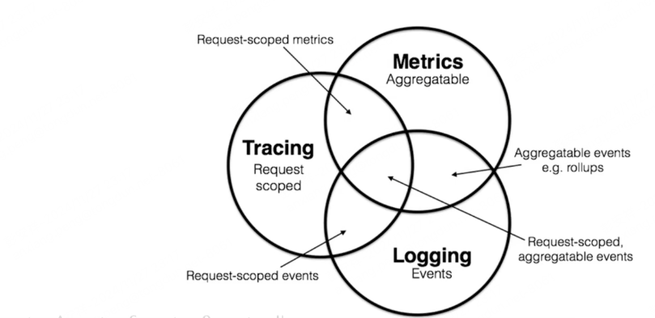

# 可观测性

- Metrics 是系统在一段时间内的某一方面的度量  Metrics是可以聚合的
   例如电商系统1分钟内的请求次数， 为每个HTTP接口添加一个计数器，计算每个接口的QPS之后通过简单的加和计算得到系统的负载情况
  Zabbix  Open-falcon Prometheus 等
- Logging 记录行为的离散事件
   例如将这些日志信息记录到通过EFK、Graylog等系统存入ElasticSearch，然后通过Kibana 或者其他工具分析，特点日志记录数据很分散，并且相互独立。
- Tracing  分布式链路追踪
   在微服务架构系统中的一个请求会经过很多服务处理，调用链路会非常的长，要确定中间那个服务异常是非常麻烦的一件事，通过分布式链路追踪，运维人员可以构建一个请求的视图，视图上展示一个请求从进入系统开始到返回响应的整个流程。
- 
- 

