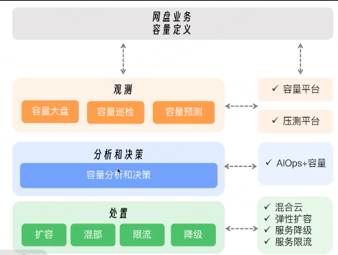
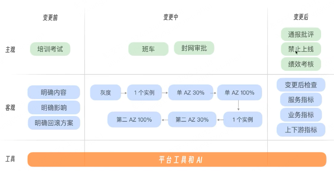
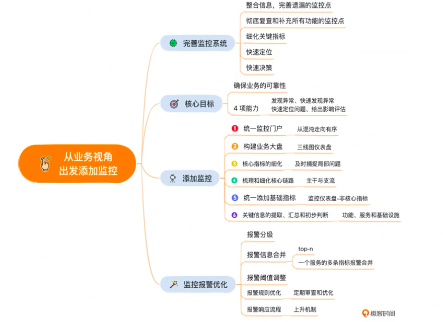
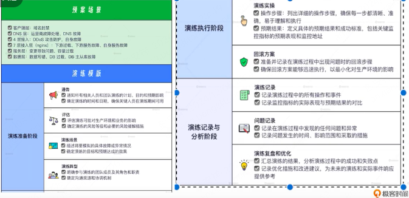
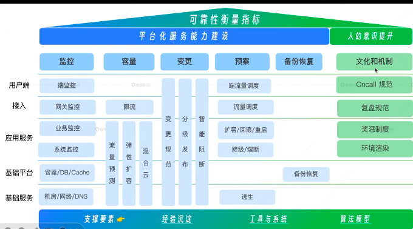
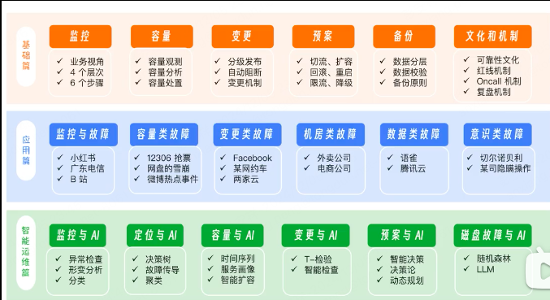
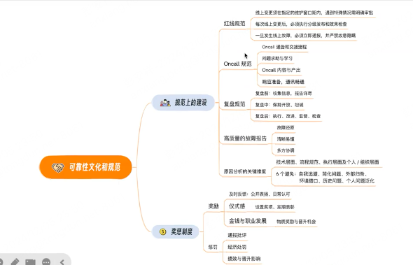

## SRE 稳定体系

1. 部署架构设计
   高可用
   弹性
   双活、多活、两地三中心
   容灾备份（数据库备份、文件备份）
2. 容量规划
   

3. 发布、变更管理体系

   

4. 监控覆盖

   
5. 应急预案以及故障切换
   

6. 事故复盘以及缺陷问题修复

7. 混沌工程

8. 文化体系
 
9.
SRE 稳定体系，即 Site Reliability Engineering（网站可靠性工程）稳定体系，是一种软件工程实践，旨在通过系统工程的方法来确保网站和服务的可靠性和稳定性。以下是对 SRE 稳定体系的详细解析：

一、定义与目标
定义：SRE 稳定体系强调开发和运维的有机结合，通过一系列的手段和流程来提高系统的可靠性和可用性，同时降低运营成本和风险。
目标：
提高系统的可靠性和可用性。
降低运营成本和风险。
实现自动化、监控、容量规划、故障排除和持续改进。
二、工作职责
保障线上服务的稳定性：
监控系统的运行状态，及时发现并处理故障。
实施容量规划，确保系统在高负载下仍能正常运行。
进行故障排查和恢复，缩短故障恢复时间（MTTR）。
建设工具 / 平台 / 基础设施：
开发和使用自动化工具，提高运维效率。
构建和管理运维平台，支持系统的监控、报警和日志分析。
优化基础设施，提高系统的性能和可扩展性。
用技术手段来控制、优化服务的运行成本：
实施资源优化策略，降低资源消耗。
引入新技术和工具，提高运维效率和质量。
三、实践方法
微服务：
采用微服务架构，将大型系统拆分为多个小型、独立的服务。
每个服务由一个小团队负责开发和维护，提高团队协作效率。
容器化：
使用容器技术（如 Docker）封装应用，实现应用的标准化和可移植性。
降低环境异构带来的应用交付复杂度，提高应用交付效率。
自动化：
实现应用管理自动化，包括开发、测试、发布和运维等环节。
引入 CI/CD（持续集成 / 持续部署）流程，加速业务应用迭代。
监控与报警：
建立全面的监控系统，实时采集系统的运行状态数据。
设置合理的报警阈值，及时发现并处理潜在问题。
混沌实验：
通过模拟现网真实故障来验证服务的“韧性”。
找出系统的弱点，同时验证监控和报警系统的有效性。
故障管理：
建立完善的故障管理流程，包括故障发现、定位、处理和复盘等环节。
引入故障指挥官角色，负责协调各层人员分工和消息收敛。
四、评估与优化
服务水平目标（SLO）：
根据业务需求设定合适的服务水平目标（SLO）。
监控并跟踪 SLO 的执行情况，及时发现并优化潜在问题。
量化指标：
采用量化指标（如 MTTR、MTBF、可用性、容量等）来评估系统的稳定性和性能。
根据量化指标的变化情况，制定针对性的优化策略。
持续改进：
定期对系统进行复盘和回顾，总结经验教训。
引入新技术和工具，不断优化运维流程和方法。
综上所述，SRE 稳定体系是一种面向用户稳定性的工程实践，通过一系列的手段和流程来提高系统的可靠性和可用性。在实践中，需要注重微服务、容器化、自动化、监控与报警、混沌实验以及故障管理等方面的应用和优化。同时，还需要根据业务需求设定合适的服务水平目标（SLO），并采用量化指标来评估系统的稳定性和性能。

1. 基础设施管理与优化
   硬件与软件管理：负责服务器、网络设备、存储设备等硬件的采购、部署、维护和升级，以及操作系统、数据库、中间件等软件的安装、配置和优化。
   云服务与容器化：利用云服务提供商的资源进行弹性部署，采用容器化技术（如 Docker）提高应用的可移植性和可扩展性。
2. 自动化与工具开发
   持续集成与持续部署（CI/CD）：通过自动化工具实现代码的编译、测试、部署和监控，加速产品迭代速度。
   运维自动化：开发和使用自动化脚本和工具，实现日常运维任务的自动化，如系统备份、日志收集、安全扫描等。
3. 监控与报警系统
   实时监控：建立全面的监控系统，实时采集系统的运行状态数据，包括 CPU、内存、磁盘、网络等性能指标。
   智能报警：设置合理的报警阈值和策略，通过邮件、短信、电话等方式及时通知相关人员处理潜在问题。
4. 故障排查与恢复
   故障定位：利用日志分析、性能监控等手段快速定位故障原因。
   故障恢复：制定并实施故障恢复计划，确保系统在最短时间内恢复正常运行。
5. 容量规划与扩展
   容量评估：根据业务需求和历史数据评估系统的容量需求。
   弹性扩展：利用云服务或自动化工具实现系统的弹性扩展，确保在高并发或大规模数据处理时系统的稳定性和性能。
6. 安全与合规
   安全防护：实施网络安全、数据安全、应用安全等防护措施，确保系统免受攻击和数据泄露。
   合规性检查：遵守相关法律法规和行业标准，定期进行合规性检查和审计。
7. 持续改进与培训
   复盘与总结：定期对系统稳定性事件进行复盘和总结，提炼经验教训。
   技能培训：组织团队成员参加培训和交流活动，提高专业技能和团队协作能力。
   综上所述，SRE 稳定体系是一个涵盖基础设施管理、自动化与工具开发、监控与报警系统、故障排查与恢复、容量规划与扩展、安全与合规以及持续改进与培训等多个方面的综合性框架。通过不断优化和完善这个体系，可以确保线上服务的稳定性和可靠性，提高用户体验和业务价值。
8. MTTR（平均故障修复时间）
   定义：MTTR 是指从系统发生故障到恢复正常运行所需的平均时间。它反映了系统在出现故障后的恢复能力。
   优化：降低 MTTR 是 SRE 的重要目标之一。通过提高故障排查效率、优化故障恢复流程、加强团队协作和沟通等方式，可以有效缩短 MTTR。
9. MTBF（平均故障时间间隔）
   定义：MTBF 是指系统正常运行期间无故障发生的平均时间长度。它反映了系统的稳定性和可靠性。
   优化：提高 MTBF 也是 SRE 的重要任务之一。通过改进系统设计、加强硬件和软件的质量管理、实施定期维护和升级等方式，可以延长 MTBF。
